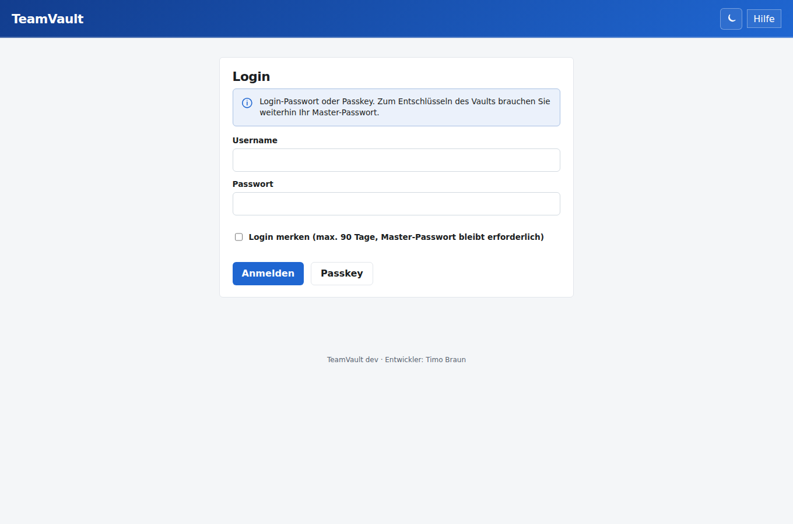
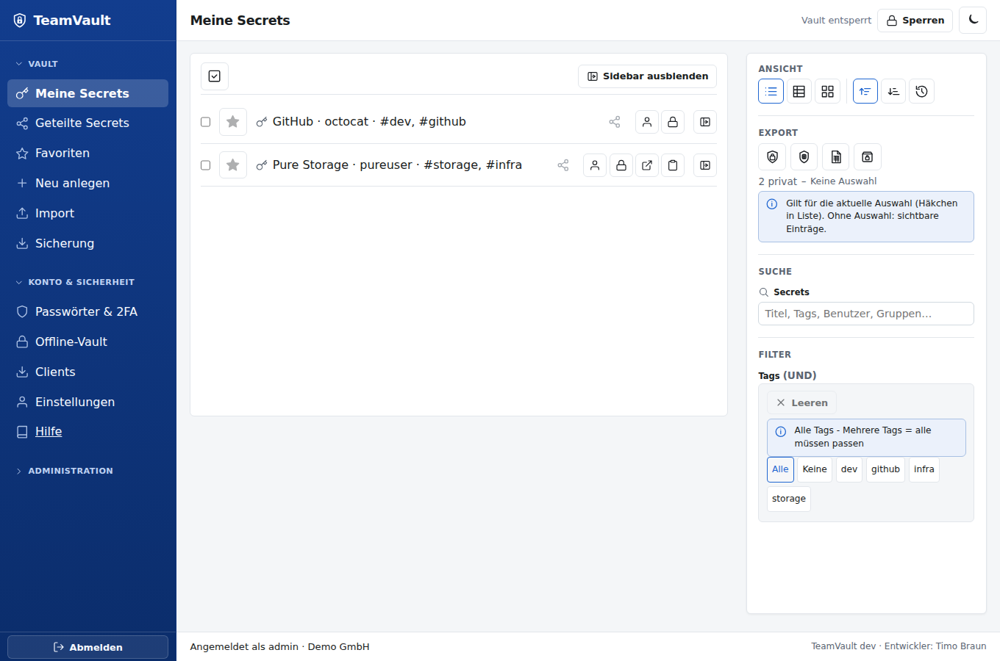
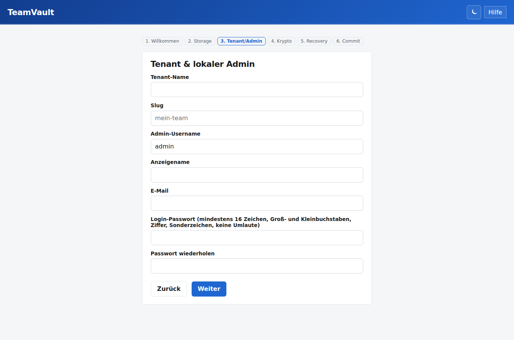
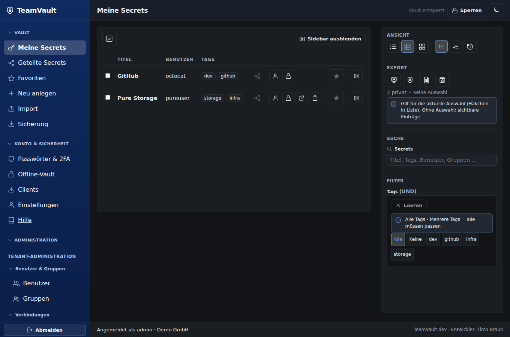

# TeamVault

Self-hosted, **Zero-Knowledge** Passwortmanager für Firmennetze (Multi-Tenant).  
Secrets und Titel werden nur im Browser entschlüsselt — Server und Storage sehen ausschließlich Ciphertext.



## Was die App kann

| Bereich | Funktionen |
|---------|------------|
| **Vault** | Secrets anlegen/öffnen (Titel, User, Passwort, Extra-Felder, TOTP), Suche/Ordner, Import aus anderen Tools, Export einzeln/mehrere/alle, verschlüsselte Sicherung |
| **Sharing** | Pro berechtigtem User eigener Datenschlüssel (asymmetrisch); Entzug mit Pflicht-Rotation |
| **Auth** | Lokales Login immer; optional LDAP/AD nur für Bind; TOTP (Web: zweistufig); Passkeys (nur Login); Self-Service Passwort-Wechsel |
| **Vault-UX** | Favoriten (lokal), Sortierung A–Z/Z–A/Recent, Suche/Tags, Import/Export |
| **Onboarding** | Erzwungenes Master-Passwort + Schlüsselpaar; Recovery-Kit oder Admin-Escrow (Shamir) |
| **Admin** | User/Gruppen, Firmen-CA, LDAP, SMTP, Krypto/Policy, Audit, API-Keys (`read`/`vault`/`admin`), Tenants, Storage-Migration, Instanz-Backup/Restore |
| **Clients** | Web-UI, CLI (`tvcli`), Browser-Extension (Chrome/Edge/Firefox; Fill/Copy mit Origin-Match; Sichtbarkeit per Policy), Desktop-App (Linux/Windows, reine Vault-Funktionen, Offline-Cache, Tray, Autostart) |



## Sicherheitsprinzipien (kurz)

1. Zero-Knowledge — kein Klartext-Secret auf dem Server  
2. Client-Crypto — WebCrypto / NaCl / Argon2id  
3. Hybrid-Auth — LDAP nur Login, Rechte immer lokal  
4. Ein externes Bootstrap-Secret: Unlock-Keyfile (≥32 Byte Entropie)

Details: [`.cursor/rules/security-principles.mdc`](.cursor/rules/security-principles.mdc)

## Dokumentation

| Guide | Zielgruppe |
|-------|------------|
| [**Installationsanleitung**](docs/install-guide.md) | One-Liner Docker / Go, `.env`, Unlock-Key |
| [**User Guide**](docs/user-guide.md) | Alltag: Login, Onboarding, Vault, Sharing, Import/Export, Hilfe (`/help`, `/help/vault`) |
| [**CLI Guide**](docs/cli-guide.md) | tvcli installieren & nutzen (auch in der App: `/help/cli`) |
| [**Desktop Guide**](docs/desktop-guide.md) | Native Desktop-App (Linux/Windows): Installation ohne Adminrechte, Offline-Vault, Tray, Autostart |
| [**Extension Guide**](docs/extension-guide.md) | Browser-Extension (auch: `/help/extension`) |
| [**Admin Guide**](docs/admin-guide.md) | Betrieb: Setup, LDAP/SMTP, Escrow, Proxy/TLS, Instanz-Backup, CI |
| [**Roadmap**](docs/planning/roadmap-phase9plus.md) | Weitere Ausbaupfade (Hardening, UX, Perf, Features) |
| [**Vergleich Password Manager**](docs/planning/competitive-comparison.md) | TeamVault vs. Bitwarden, Vaultwarden, Passbolt, … |
| [Clients](clients/README.md) | CLI-Binaries & Extension |
| [OpenAPI](docs/openapi.yaml) | REST-API (`GET /openapi.yaml` am Server) |
| [Planung](docs/planning/) | Architektur, Crypto, Entscheidungen |

## Entwickler & Version

**Entwickler:** Timo Braun  

Die laufende Version liefert `GET /api/version` bzw. `teamvault -version` (Build-Infos per `-ldflags`). In der Web-UI erscheinen Version (SemVer) und Mandantenname im Footer; Entwickler in Sidebar/Hilfe.

## Stack

| Schicht | Technologie |
|---------|-------------|
| Backend | Go (`cmd/teamvault`) |
| Web-UI | Vanilla JS eingebettet (`web/static`) |
| Client-Crypto | `web/static/cryptocore.js` / `internal/cryptocore` (Argon2id, NaCl) |
| Storage | SQLite (Default) oder JSON-File |
| Clients | `tvcli` (standalone Win/Linux), Browser-Extension, Desktop-App (Wails, Win/Linux) |

## Schnellstart

### One-Liner (empfohlen)

**Docker** (Linux/macOS):

```bash
curl -fsSL https://raw.githubusercontent.com/TimUx/TeamVault/main/scripts/install-docker.sh | bash
```

**Docker** (Windows PowerShell):

```powershell
irm https://raw.githubusercontent.com/TimUx/TeamVault/main/scripts/install-docker.ps1 | iex
```

**Go** ohne Container (Go 1.25+):

```bash
curl -fsSL https://raw.githubusercontent.com/TimUx/TeamVault/main/scripts/install-go.sh | bash
```

```powershell
irm https://raw.githubusercontent.com/TimUx/TeamVault/main/scripts/install-go.ps1 | iex
```

Die **Docker**-Skripte fragen nach dem Installationspfad, legen dort nur Compose/Env + Unlock-Keyfile an (kein Git-Clone), wählen den **ersten freien Port ab 8080** und starten das GHCR-Image. **Go** nutzt dieselben Prinzipien (schlanke Installation, Release-Binary). Setup-URL steht in der Installer-Ausgabe. Details: [Installationsanleitung](docs/install-guide.md).

Danach: Wizard → Login → Onboarding → Vault.



### Manuell (Entwicklung)

```bash
cp .env.example .env
mkdir -p secrets data
openssl rand -out secrets/teamvault_unlock 48
set -a; source .env; set +a
go test ./...
go run ./cmd/teamvault
```

## Docker

Compose zieht standardmäßig die von CI nach **GHCR** gepushten Images (`main` → `:latest`, Tags `v*` → SemVer), kein lokaler Build.

Unlock-Key **nicht** ins Image legen — als Keyfile mounten. Compose liest `.env` (Vorlage: `.env.example`):

```bash
cp .env.example .env
mkdir -p secrets
openssl rand -out secrets/teamvault_unlock 48
docker compose pull && docker compose up -d
# Image: ghcr.io/timux/teamvault:latest  (Prod: :1.3.26 in .env pinnen)
# → http://127.0.0.1:8080/setup

# Nur bei Bedarf lokal bauen:
# docker compose -f docker-compose.yml -f docker-compose.build.yml up -d --build
```

Dateien: `Dockerfile`, `docker-compose.yml`, `docker-compose.build.yml`, `.env.example`, `.dockerignore`. Persistenz: Volume `teamvault_data`.

## CLI & Extension

```powershell
.\scripts\build-tvcli.ps1
# → dist/tvcli-windows-amd64.exe, dist/tvcli-linux-amd64, …
.\dist\tvcli-windows-amd64.exe -base http://127.0.0.1:8080 login -tenant demo -user admin
```

Extension: Ordner `clients/extension` in Chrome/Edge (Entwicklermodus) laden — siehe [clients/README.md](clients/README.md).

## Desktop-App (Linux/Windows)

Native, reine Vault-App (Wails v2/Go) mit Offline-Cache, Tray-Icon und Autostart — ohne Adminrechte installier-/ausführbar. Details: [Desktop Guide](docs/desktop-guide.md).

```bash
./scripts/build-desktop.sh          # Linux: Binary + AppImage
```

```powershell
.\scripts\build-desktop.ps1 -Installer   # Windows: portable .exe + Pro-Benutzer-Installer
```

## CI (GitHub Actions)

Workflow [`.github/workflows/docker.yml`](.github/workflows/docker.yml): Unit-Tests im Docker-Target `test`, danach Image-Build und Push nach **GHCR**.

| Trigger | Tags (Auszug) |
|---------|----------------|
| `main` | `latest`, `main`, `sha-…` |
| `v1.3.26` | `1.3.26`, `1.3` |

```bash
docker pull ghcr.io/timux/teamvault:latest
docker pull ghcr.io/timux/teamvault:1.3.26
```

Compose nutzt diese Images standardmäßig (`TEAMVAULT_IMAGE` in `.env`).

### Gitea Actions (lokal, Firmenproxy)

Workflow [`.gitea/workflows/build.yml`](.gitea/workflows/build.yml): baut die Binaries (`teamvault`, `tvcli`) und das Docker-Image in einer **lokalen Gitea-Instanz** inkl. Push in deren Registry. Hosts für Registry, Gruppe, Firmenproxy usw. werden über **Repository-Variablen/Secrets** konfiguriert — siehe [docs/gitea-ci.md](docs/gitea-ci.md).

## Bootstrap-Unlock

| Umgebung | Variable |
|----------|----------|
| Prod | `TEAMVAULT_MASTER_UNLOCK_KEY_FILE` (Keyfile; bei Docker Pfad in `.env` → Compose-Mount) |
| Dev | `TEAMVAULT_MASTER_UNLOCK_KEY` (Fallback, Key-Bytes in Env — nicht in Install-Skripten) |

Vorlage: [`.env.example`](.env.example). Der Key entsperrt nur die **verschlüsselte Config** — keine Vault-Klartexte.

## Überblick

TeamVault umfasst Setup-Wizard, Zero-Knowledge-Vault, Sharing mit Envelope-Rotation, Import/Export und verschlüsselte Sicherung, Admin (User/LDAP/SMTP/Policy/Escrow/API-Keys/Instanz-Backup), Passkeys (nur Login), OpenAPI, CLI und Browser-Extension.

Betriebs-Checkliste: [`SECURITY-REVIEW-CHECKLIST.md`](SECURITY-REVIEW-CHECKLIST.md) · Installation: [`docs/install-guide.md`](docs/install-guide.md)


