# TeamVault – Admin Guide

Betrieb und Verwaltung der Instanz. Für den Alltag der Endanwender: [User Guide](user-guide.md).

**Entwickler:** Timo Braun · Version der laufenden Instanz: `GET /api/version` oder `teamvault -version` (auch in der Web-UI Sidebar/Footer).

## 1. Rollen

| Rolle (technisch) | Anzeige in der UI | Rechte (Auszug) |
|-------------------|-------------------|-----------------|
| `member` | Mitglied | Vault nur für eigene/geteilte Secrets |
| `tenant_admin` | Organisations-Administrator | User, Gruppen, LDAP (eigenen Tenant), Recovery, Audit (Tenant) |
| `platform_admin` | Plattform-Administrator | Instanz: Firmen-CA, Proxy, SMTP, Krypto/Policy, API-Keys, System, Tenants, Migration |
| `auditor` | Auditor (nur Lesen) | Audit-Log einsehen, keine Schreibaktionen |

Der erste User aus dem Setup-Wizard erhält **beide** Admin-Rollen (`tenant_admin` + `platform_admin`).

## 2. Erstinstallation

Ausführlich inkl. One-Liner: [**Installationsanleitung**](install-guide.md).

### 2.1 Voraussetzungen

- **Docker** + Compose v2 **oder** Go 1.23+
- Persistentes Datenverzeichnis / Volume
- Unlock-Keyfile ≥ **32 Byte** hohe Entropie (kein Passwort)

### 2.2 One-Liner

Docker: nur Compose/Env + Unlock-Keyfile (kein Repo-Clone). Go: schlanke Installation mit Release-Binary (kein Repo-Clone). Details: [Installationsanleitung](install-guide.md).

```bash
# Docker (empfohlen)
curl -fsSL https://raw.githubusercontent.com/TimUx/TeamVault/main/scripts/install-docker.sh | bash

# Go (ohne Container)
curl -fsSL https://raw.githubusercontent.com/TimUx/TeamVault/main/scripts/install-go.sh | bash
```

```powershell
# Docker
irm https://raw.githubusercontent.com/TimUx/TeamVault/main/scripts/install-docker.ps1 | iex

# Go
irm https://raw.githubusercontent.com/TimUx/TeamVault/main/scripts/install-go.ps1 | iex
```

### 2.3 Unlock-Key und `.env`

Der Unlock-Key entsperrt nur die Config-DB. Vault-Secrets bleiben Zero-Knowledge.

**Empfohlen:** Keyfile + `.env` (Compose lädt `.env` automatisch; Key-Bytes nie in die `.env` schreiben).

```bash
cp .env.example .env
mkdir -m 700 -p secrets
openssl rand -out secrets/teamvault_unlock 48
chmod 644 secrets/teamvault_unlock   # Image = nonroot (UID 65532); Verzeichnis bleibt 700
# .env enthält z. B.:
#   TEAMVAULT_UNLOCK_KEY_HOST=./secrets/teamvault_unlock
#   TEAMVAULT_PUBLISH_PORT=8080
#   TEAMVAULT_IMAGE=ghcr.io/timux/teamvault:latest
```

```powershell
Copy-Item .env.example .env
New-Item -ItemType Directory -Force secrets | Out-Null
# openssl rand -out secrets/teamvault_unlock 48
```

| Variable | Verwendung |
|----------|------------|
| `TEAMVAULT_MASTER_UNLOCK_KEY_FILE` | Pfad zum Keyfile (Prod / Go) |
| `TEAMVAULT_MASTER_UNLOCK_KEY` | Nur Dev/Test-Fallback (Key-Bytes in Env) |
| `TEAMVAULT_PUBLISH_PORT` / `TEAMVAULT_UNLOCK_KEY_HOST` | Docker Compose via `.env` |
| `TEAMVAULT_IMAGE` | GHCR-Image, z. B. `ghcr.io/timux/teamvault:1.3.26` |
| `TEAMVAULT_PULL_POLICY` | Default `always` |

### 2.4 Start

```bash
# Docker: immer zuerst pullen (CI-Images)
docker compose pull && docker compose up -d

# Go: .env laden
set -a; source .env; set +a
go run ./cmd/teamvault
# bzw. ./bin/teamvault nach go build
```

Browser: `/setup` — solange `initialized=false`. Beim ersten Start schreibt die Instanz ein **einmaliges Setup-Token** nach `{data-dir}/setup.token` (Datei 0600) und loggt es auf stderr. Der Wizard und `POST /api/setup/commit` verlangen Header `X-TeamVault-Setup-Token` (oder JSON-Feld `setup_token`). Ohne Token kein Setup-Takeover über den offenen Port (Default `:8080`). Nach erfolgreichem Commit wird die Datei gelöscht.

### 2.5 Setup-Wizard

| Schritt | Inhalt |
|---------|--------|
| Willkommen | Kurzinfo Zero-Knowledge |
| Storage | SQLite (Default) oder JSON-File |
| Tenant/Admin | Erster Tenant + lokaler Admin (Login-Passwort: mindestens 16 Zeichen, Groß-/Kleinbuchstaben, Ziffer, Sonderzeichen, keine Umlaute) |
| Krypto | Argon2id-Parameter (clientseitige Vault-KDF) |
| Recovery | `user_kit` und/oder Escrow erlaubt |
| Commit | Atomare Initialisierung |

#### Storage

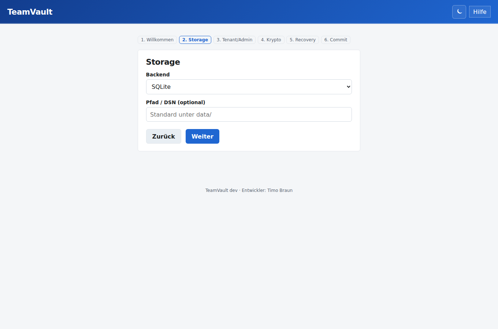

#### Tenant & lokaler Admin


#### Argon2id (Vault-KDF)

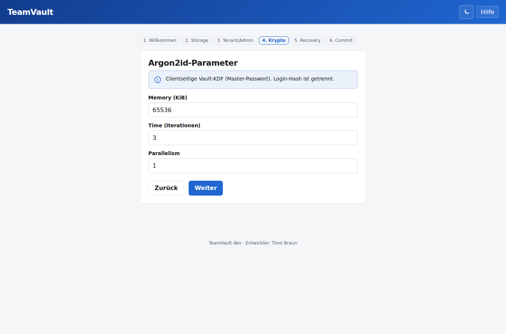

#### Key-Recovery

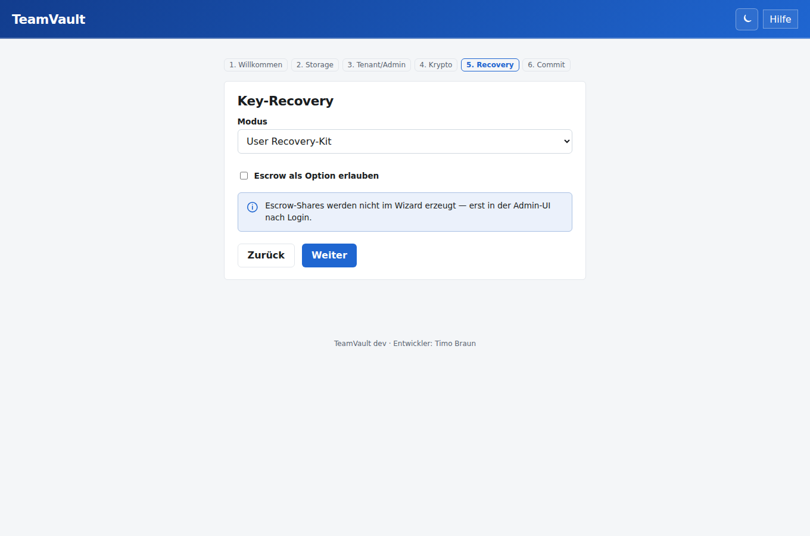

#### Review & Commit

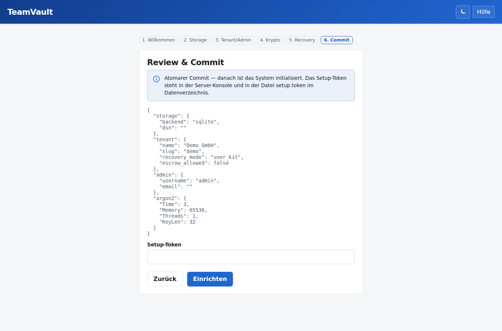

Nach dem Commit: Login → **Vault-Onboarding** (Master-Passwort) → App.

## 3. Admin-UI (nach Vault-Entsperren)

In der **Sidebar** unter **Administration** (sichtbar für `tenant_admin` / `platform_admin`; Auditoren nur **Audit**). Die Bereiche **Vault**, **Konto** und **Administration** sind einklappbar; unter Administration gibt es vier Untergruppen:

| Untergruppe | Menüpunkte |
|-------------|------------|
| **Benutzer & Gruppen** | Benutzer, Gruppen |
| **Verbindungen** | LDAP (Tenant-Admin); Firmen-CA, Zugriff & Proxy, SMTP (nur Plattform-Admin) |
| **Sicherheit** | Recovery & Escrow (Tenant-Admin); Krypto & Policy, API-Keys (nur Plattform-Admin) |
| **Plattform** | Audit (Tenant-Admin); Tenants & Migration, **System** (nur Plattform-Admin) |

Topbar-Theme nutzt flache Inline-SVG-Icons (kein externes Icon-CDN). Jeder Unterpunkt öffnet den jeweiligen Abschnitt. Storage-Übersicht und Versionsinfo stehen unter **Plattform → System** (nicht mehr oben in jedem Admin-Panel).

### 3.1 Benutzer

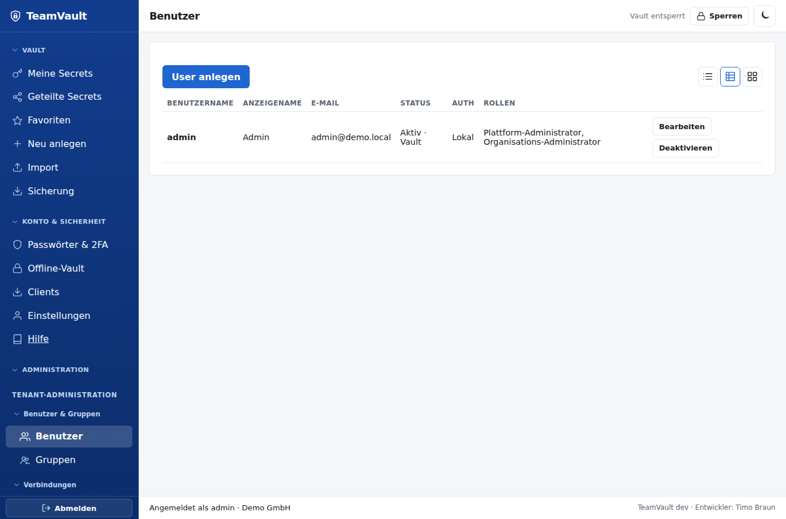

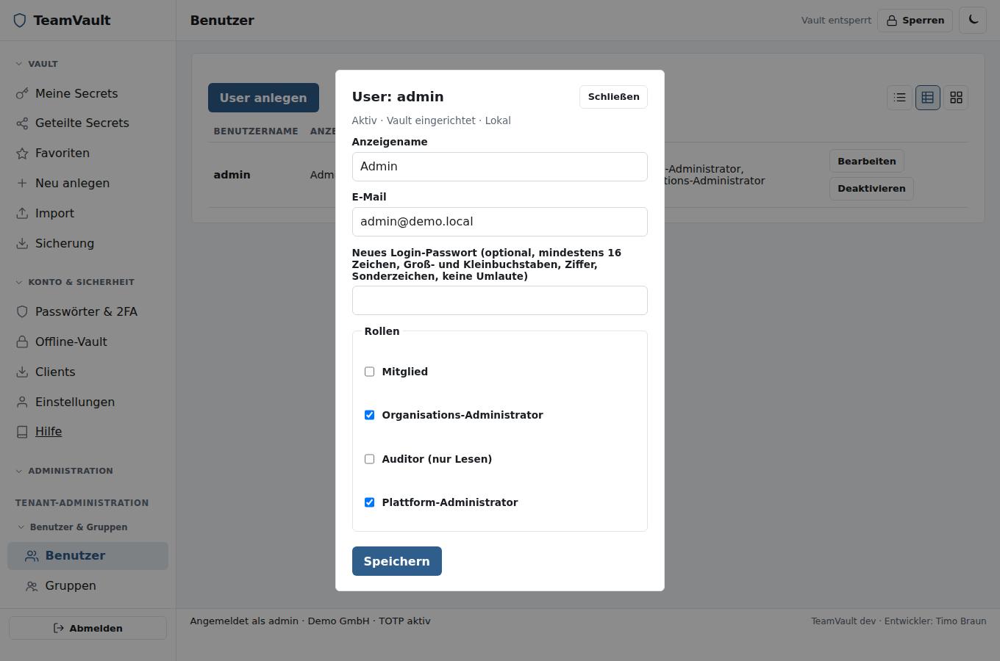

- **User anlegen** öffnet ein **Modal** (nicht mehr am Seitenende): Auth-Backend (lokal / LDAP), Username, Anzeigename, E-Mail; bei **lokal** Login-Passwort (Policy wie Setup-Admin). LDAP-User ohne Passwort in TeamVault.
- **Ansicht:** Tabelle (Standard), Liste oder Kacheln — Umschalter in der Toolbar
- **Bearbeiten:** Anzeigename, E-Mail, Rollen (deutsche Bezeichnungen in der UI); für lokale User optional neues Login-Passwort (gleiche Policy)
- Status und Auth-Backend mit **deutschen Labels** (z. B. *Aktiv*, *Lokal*, *LDAP/AD*)
- **LDAP-Verzeichnis** (wenn LDAP aktiv): Verzeichnis durchsuchen und User **vor der ersten Anmeldung importieren** — danach Gruppen zuweisen ohne JIT-Login

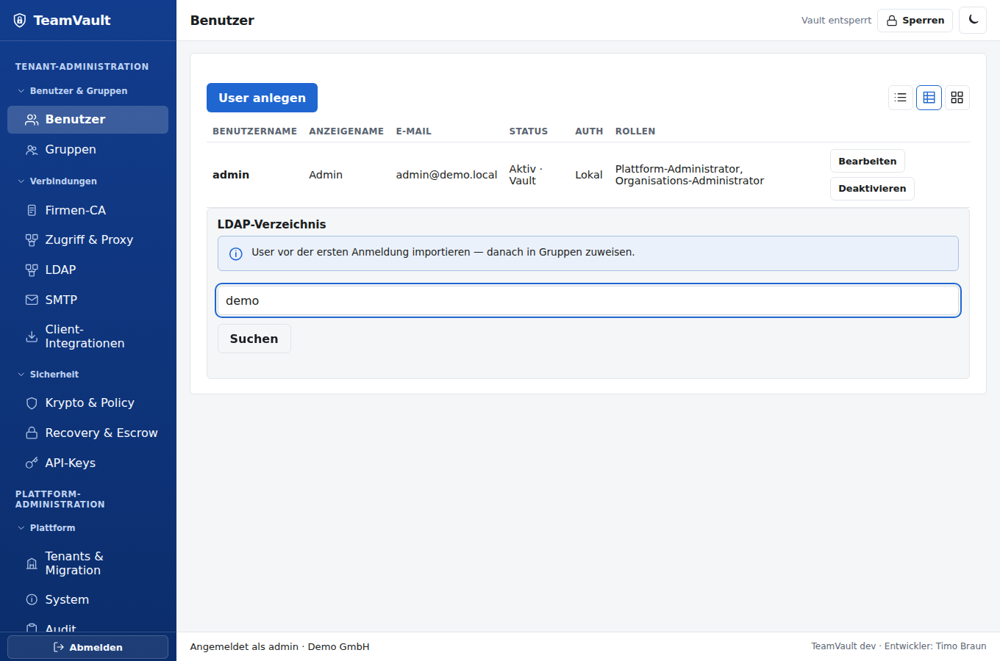

- Disable statt Löschen (LDAP-Sync deaktiviert fehlende Accounts)
- Nach **Disable**: Hinweis, Secrets mit Envelope dieses Users zu **rotieren** (Zero-Knowledge — kein Auto-Rotate). Optional Liste der Secret-IDs (Meta only).

Kein Zugriff auf Master-Passwort, Private Keys oder Recovery-Kit-Klartext.

### 3.2 System

Sidebar **Administration → Plattform → System**:

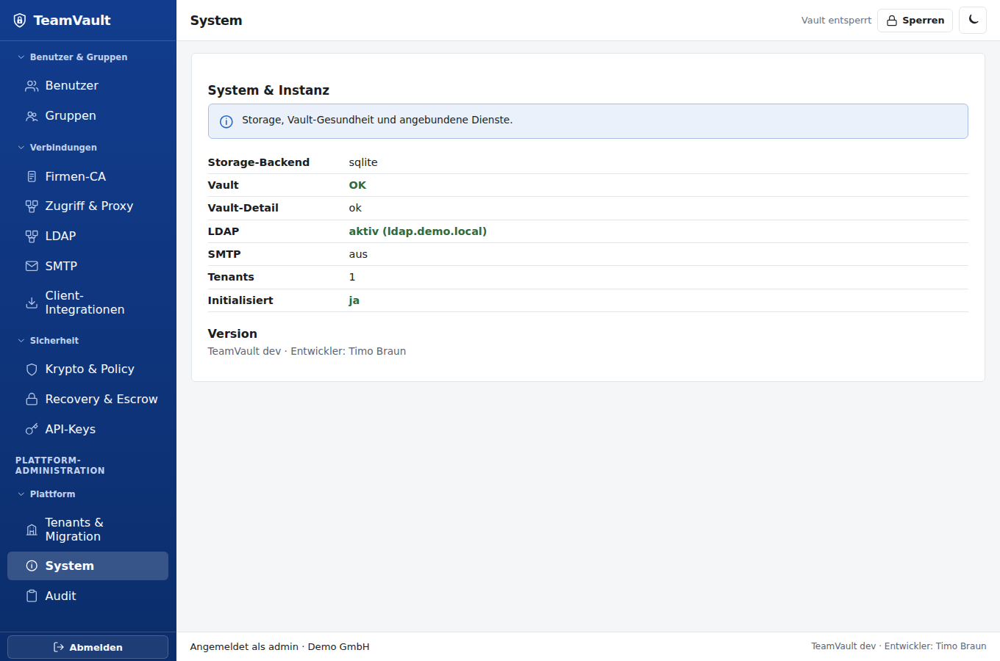

- Storage-Backend, Vault-Gesundheit, LDAP/SMTP-Status
- Produktversion und Commit (SemVer) — ergänzend zu `GET /api/version`

### 3.3 Gruppen

Sidebar **Administration → Benutzer & Gruppen → Gruppen**:

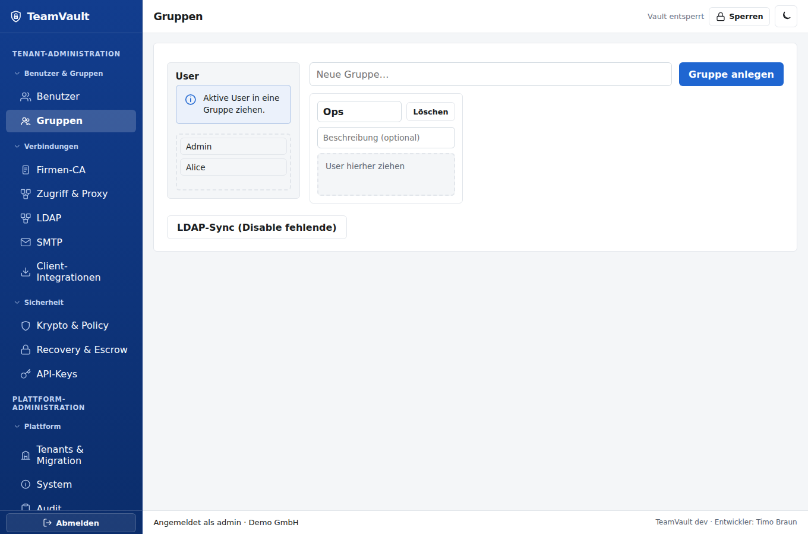

- **Zwei Bereiche:** links aktive User (ziehbar), rechts Gruppen-Karten mit Drop-Zone
- User per **Drag & Drop** in eine Gruppe ziehen; aus Gruppe zurück in den Pool ziehen = Mitgliedschaft entfernen; zwischen Gruppen ziehen = zusätzliche Mitgliedschaft
- Gruppe anlegen; **Name** und **Beschreibung** in der Karte bearbeiten (Speichern beim Verlassen des Feldes); **Löschen** mit Bestätigung
- Rechte/Sharing bleiben über lokale Zuordnung — **keine** LDAP-Gruppen-Autorisierung
- Secrets können an Gruppen geteilt werden (pro Mitglied eigener Envelope) — siehe User Guide
- **Neue Gruppenmitglieder:** Fehlende Gruppen-Freigaben werden **nicht** still beim Unlock nachgezogen. Ein berechtigter User bestätigt Catch-up inkl. Empfängerliste und TOFU-Fingerprint (`GET /api/secrets/group-share-gaps`). Ohne Bestätigung kein Wrap.

### 3.4 Zugriff & Proxy

Sidebar **Administration → Zugriff & Proxy**:

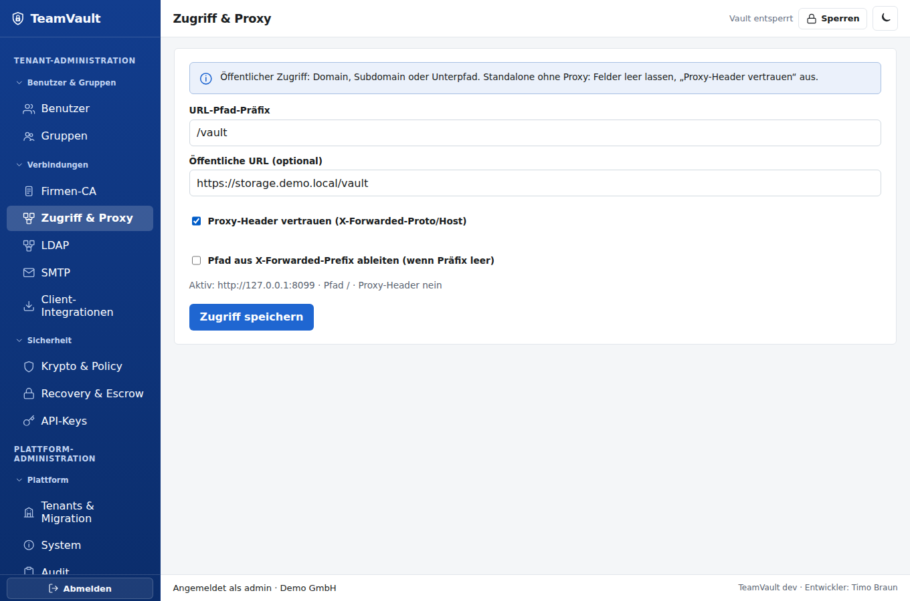

Instanzweite Einstellungen für öffentliche URL und Reverse Proxy — unabhängig von Domain, Subdomain oder Unterpfad:

| Feld | Standalone (`:8080`) | Hinter TLS-Proxy |
|------|----------------------|------------------|
| URL-Pfad-Präfix | leer | z. B. `/vault` |
| Öffentliche URL | optional | z. B. `https://storage.firma.de/vault` |
| Proxy-Header vertrauen | aus | **an** |
| X-Forwarded-Prefix | aus | optional |

Änderungen wirken sofort. Env-Variablen `TEAMVAULT_BASE_PATH` / `TEAMVAULT_TRUST_FORWARDED` überschreiben die Admin-Werte (Hinweis in der UI). Details: [§6.3](#63-unterpfad-domain--reverse-proxy).

### 3.5 Firmen-CA

Sidebar **Administration → Firmen-CA**:

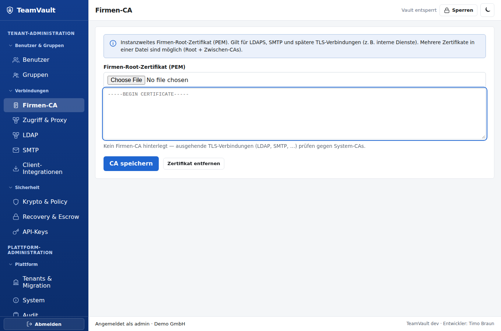

- Instanzweites Root-/Zwischen-CA-Bundle (PEM), verschlüsselt in der Config
- Wird für **LDAPS**, **SMTP** und künftige TLS-Clients (interne Dienste) verwendet
- Behebt `certificate signed by unknown authority` bei eigener PKI, ohne die Prüfung zu deaktivieren
- PEM-Datei hochladen oder einfügen; **CA speichern** / **Zertifikat entfernen**

### 3.6 LDAP / AD

Sidebar **Administration → LDAP**:

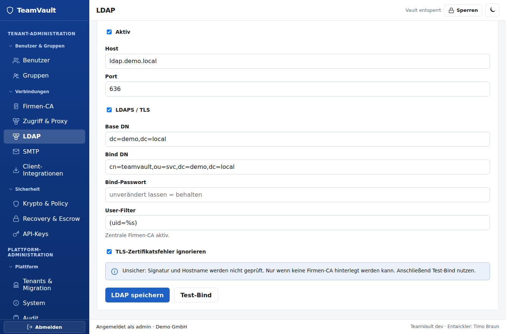

- Optional, **nur Login-Bind** (nie Autorisierung)
- Felder: Host, Port, Base DN, Bind DN/Passwort, User-Filter
- **LDAPS / TLS** (üblich Port 636). Der Hostname muss zum Zertifikat (CN/SAN) passen.
- TLS-Vertrauen über die zentrale Firmen-CA (nicht hier hochladen); Hinweis zeigt, ob eine CA hinterlegt ist
- **TLS-Zertifikatsfehler ignorieren:** unsichere Notlösung, wenn keine CA hinterlegt werden kann (Hostname und Signatur werden nicht geprüft).
- Test-Bind (nutzt die aktuellen Formularwerte, auch ungespeicherte), Speichern, LDAP-Sync (fehlende → lokal disabled)
- **Kein Passwort-Reuse gegen fremde Hosts:** Weicht Host, Port oder Bind-DN vom gespeicherten Tenant-LDAP ab, muss das Bind-Passwort **im Klartext** im Test-Request stehen. Leer oder `***` fällt nicht auf das gespeicherte Passwort zurück. Tenant-LDAP-Save übernimmt nicht das globale Bind-Passwort.
- **Vorab-Import:** Unter **Benutzer** → Block *LDAP-Verzeichnis* Verzeichnis durchsuchen (`GET /api/admin/ldap/users`) und ausgewählte Accounts importieren (`POST /api/admin/ldap/users/import`) — Gruppenzuweisung ohne vorherigen JIT-Login
- Just-in-Time bleibt möglich: erster erfolgreicher LDAP-Login legt lokalen User an (`auth_backend=ldap`), falls noch nicht importiert

### 3.7 SMTP

Sidebar **Administration → SMTP**:

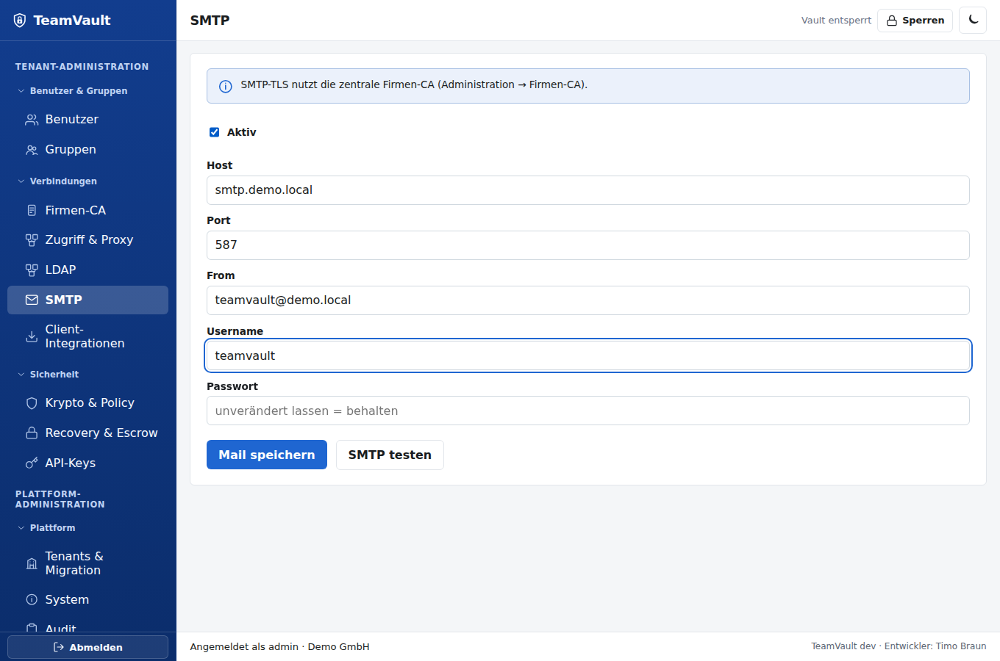

- Outbound-Mail (Einladungen/Hinweise je nach Ausbau)
- Host, Port, From, Credentials; Test-Button
- SMTP-TLS nutzt dieselbe Firmen-CA

### 3.8 Krypto & Policy

Sidebar **Administration → Krypto & Policy**:

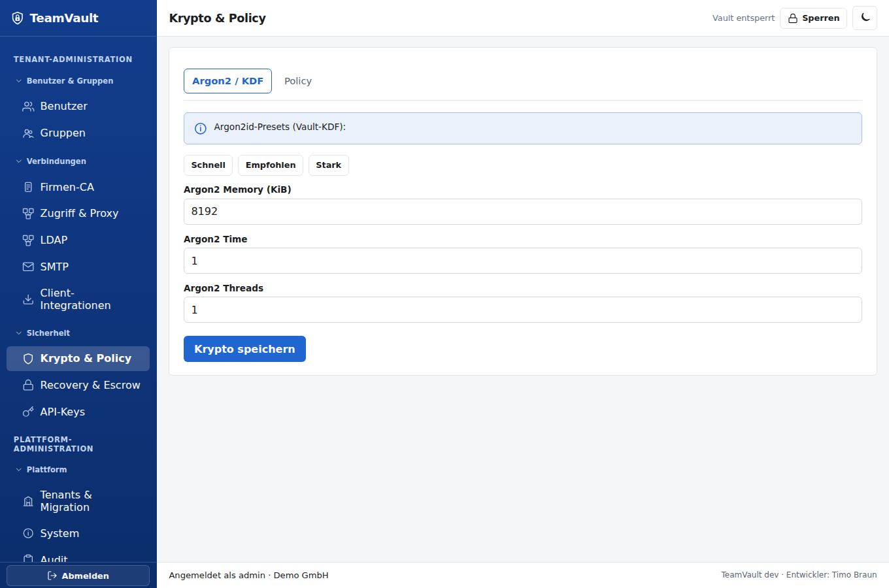

- Argon2-Defaults / Presets für neue Onboardings
- TOTP-Pflicht (Hinweis/Policy nach Login)
- **CLI-Integration anzeigen** / **Browser-Extension-Integration anzeigen** (Plattform-Administrator): steuert, ob **Konto → Clients** und die Hilfe-Einträge CLI/Extension sichtbar sind. Default: aus (GPO-/Rollout-Gründe). Downloads unter `/downloads/` bleiben unabhängig davon erreichbar.
- **Offline-Vault-Cache erlauben:** Mandantenweit Opt-in für clientseitige Ciphertext-Kopie (IndexedDB, 30 Tage TTL). Aus = Nutzer können keine Offline-Kopie anlegen; bestehende Kopien auf Geräten werden beim nächsten Online-Besuch nicht mehr aktualisiert.
- Idle-Lock der Vault-Session (Default 15 min) — nur Client-Unlock
- **Admins: Secret-Liste nur mit Envelope** (`admin_secrets_envelope_only`): Wenn aktiv, sehen Tenant-Admins in der Secret-Liste nur Einträge, für die sie selbst ein Envelope haben (Inventar-Metadaten anderer Secrets ausgeblendet). Default: aus — Admins sehen alle Secret-Metadaten (IDs, Title-Ciphertext), Klartext bleibt Zero-Knowledge-geschützt.

### 3.9 Escrow & Shamir

Wenn Recovery-Modus Escrow erlaubt (Wizard-Schritt Recovery bzw. später umschalten mit Bestätigung `REONBOARD`):

1. In der Admin-UI **Escrow-Keypair + Shares** erzeugen (clientseitig) — nur solange noch kein Pubkey gesetzt ist
2. Server speichert **nur** den Public Key
3. Private Shares offline verteilen (`k` von `n`); alternativ `tvcli escrow-split` / `escrow-combine`
4. Der vollständige Escrow-Private-Key wird **nicht** im DOM belassen — nur Shares (Anzeige + Download)
5. **Ersetzen** eines bestehenden Escrow-Keys: k Shares eingeben → Server versiegelt eine Zufalls-Challenge an den **aktuellen** Pubkey → Client öffnet die Challenge lokal → neuer Pubkey. Ohne k-aus-n (Tenant-Policy `escrow_shamir_k`, Default 3) kein Austausch.

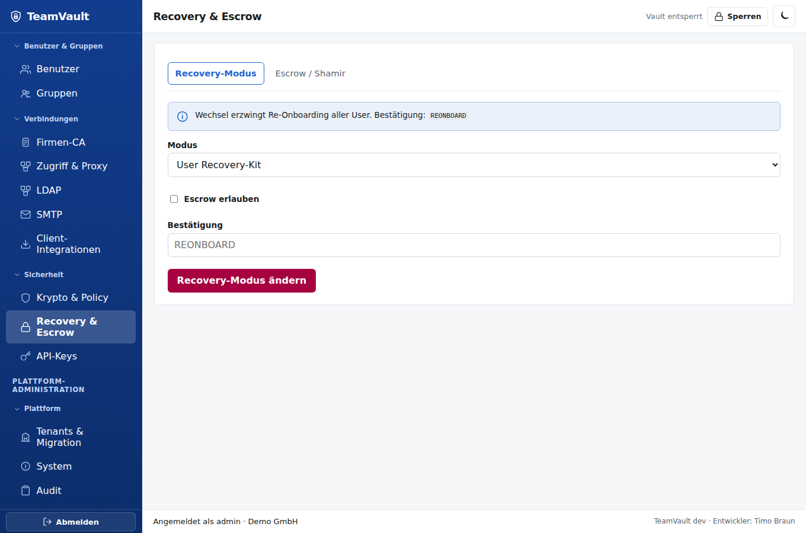

**Hinweis:** Mode-Wechsel (`user_kit` ↔ `admin_escrow`) ist **blockiert**, solange der Tenant Secrets hat (kein Key-Wipe mit Datenverlust). Escrow-Flag ohne Mode-Wechsel bleibt möglich.

Der private Escrow-Key darf nie in Logs oder dauerhaft auf dem Server landen.

### 3.10 Audit & API-Keys

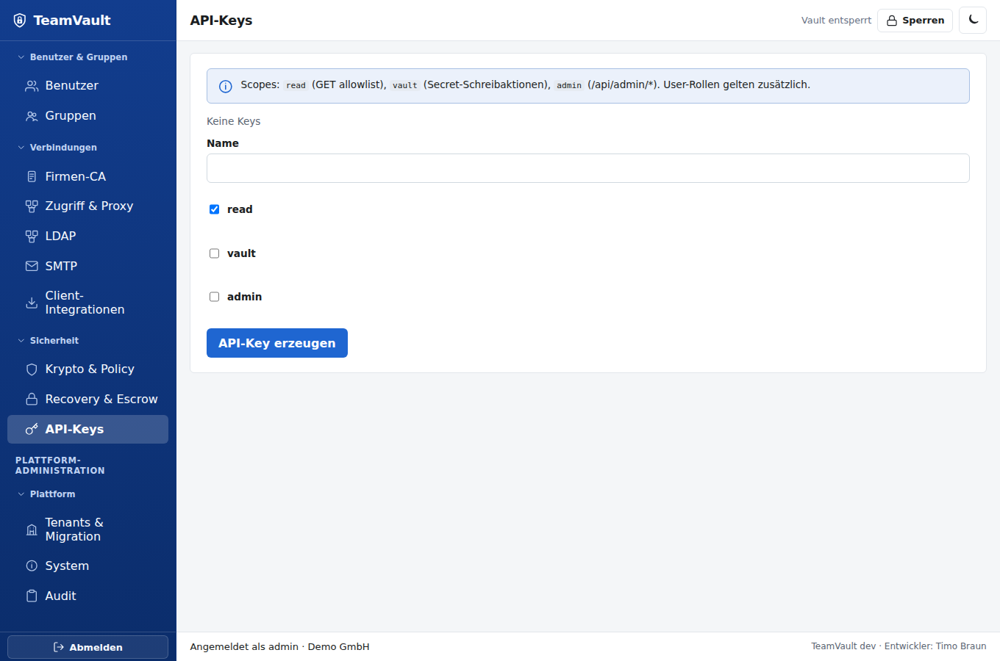

- Audit-Liste (Tenant-Ereignisse) — Fehlerhinweise erscheinen oben im Admin-Bereich; kritische Vault-Mutationen (Create/Share/Rotate/Delete) sowie Recovery-Reonboard und zentrale Admin-Mutationen scheitern, wenn der Audit-Schreibvorgang fehlschlägt
- API-Keys für Automation/CLI (`Authorization: Bearer …` / `TEAMVAULT_API_KEY`) — Token nur einmal anzeigen
- Scopes (**Pflicht** bei Neuanlage, mind. einer; UI-Checkboxen):

  | Scope | Wirkung |
  |-------|---------|
  | `read` | GET-Allowlist: me, Vault-Status/Keys, Secrets Liste/Detail, `GET /api/groups`, Presets/Policy |
  | `vault` | Secret-/Vault-Schreibaktionen (Create/Share/Rotate/Delete, …) |
  | `admin` | `/api/admin/*` — zusätzlich müssen die **User-Rollen** Admin erlauben |

- Cookie-Sessions ohne Scope-Einschränkung. **Legacy-Keys ohne Scopes** (`legacy_no_scopes` in der Key-Liste): nur **read-only** GET-Allowlist — keine Schreib- oder Admin-Aktionen. Key mit expliziten Scopes neu ausstellen und alten Key widerrufen.
- **Sitzungswiderruf:** Cookie-Sessions des Users werden nach Login-Passwortwechsel/-reset, Rollenänderung und User-Disable gelöscht; Tenant-Disable widerruft alle Sessions des Tenants. Jede Cookie-Session wird zusätzlich gegen aktuellen User-/Tenant-Status geprüft (`disabled` → 401). API-Key-Sessions liegen nicht im Cookie-Store.
- Nach User-Disable: Secrets mit Envelope dieses Users rotieren (Hinweis + Liste `accessible-secrets` in Admin-UI; kein Auto-Rotate wegen ZK)
- Tenant-Admins sehen standardmäßig in der Secret-Liste **Metadaten** (IDs, Title-Ciphertext) auch ohne eigenen Envelope — optional einschränkbar über Policy (siehe §3.8)

### 3.11 Tenants, Storage-Migration & Instanz-Backup (`platform_admin`)

- Weitere Tenants anlegen
- Migration SQLite ↔ JSON: nur Ciphertext; Bestätigung `MIGRATE`
- **Instanz-Snapshot** herunterladen / wiederherstellen (`GET /api/admin/backup`, `POST /api/admin/backup/restore` mit `confirm=RESTORE`) — siehe §5

## 4. Docker & Package

Siehe [Installationsanleitung](install-guide.md) und Root-[README](../README.md#docker). Compose nutzt `.env` und mountet:

- Volume `/data` — Vault/Config
- Unlock-Datei → `/run/secrets/teamvault_unlock` (read-only), Host-Pfad über `TEAMVAULT_UNLOCK_KEY_HOST`

Default-Image: `ghcr.io/timux/teamvault:latest` (`TEAMVAULT_IMAGE`) — von CI nach Push auf `main` / Tags `v*` veröffentlicht. Compose hat **keinen** lokalen `build:`-Schritt; nur Pull (`pull_policy: always`).

```bash
docker compose pull && docker compose up -d
```

Pin auf Release (empfohlen Prod): `TEAMVAULT_IMAGE=ghcr.io/timux/teamvault:1.3.26` in `.env`.  
Lokaler Build nur bei Bedarf: `docker compose -f docker-compose.yml -f docker-compose.build.yml up -d --build` bzw. Install-Skript mit `TEAMVAULT_BUILD=1`.

Unlock-Key nie ins Image legen.

### 4.1 Client-Downloads (CLI & Extension)

**Docker-Image:** `tvcli` (vier Plattformen), `teamvault-extension.crx` / `.zip` / `.xpi` sowie Policy-Vorlagen (`extension/updates.xml`, `chrome-policy.json`, …) sind im Image unter `/opt/teamvault/bundled-downloads/` enthalten. Beim Serverstart werden fehlende oder ältere Dateien nach **`<data-dir>/downloads/`** kopiert und unter **`/downloads/`** ausgeliefert.

**Web-App:** Nutzer finden Downloads unter **Konto → Clients**; die Hilfe unter **`/help/cli`** und **`/help/extension`** zeigt dieselben Buttons und Installations-Einzeiler.

**Extension (normal):** Nutzer führen einmal `extension-user.ps1` aus (setzt `ExtensionSettings` + `ExtensionInstallSources` für Chrome/Edge), danach klicken sie auf **Extension installieren**. IT kann stattdessen `extension-policy.ps1` zentral (HKLM/GPO) ausrollen.

Die Chrome-Extension-ID `bmokcifdhcgeeenfpomdpmkccgmgnhhd` ist **verbrannt** (kompromittierter Signierschlüssel). Policy- und Update-XML müssen die **neue** ID aus dem aktuellen `manifest.json` / gepackten CRX verwenden. `.pem`-Signierschlüssel bleiben gitignored und liegen nicht im Extension-Pack-Root.

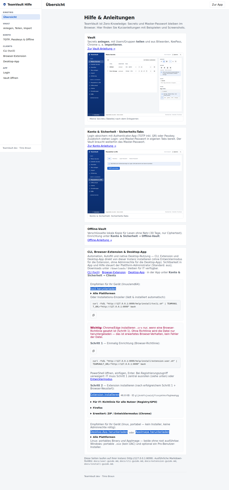

**Manuell / Dev ohne Image-Bundle** — nach `scripts/pack-clients.ps1`:

```powershell
New-Item -ItemType Directory -Force data\downloads | Out-Null
Copy-Item dist\tvcli-* data\downloads\
Copy-Item dist\teamvault-extension.* data\downloads\
Copy-Item -Recurse dist\extension data\downloads\
```

Optional: `TEAMVAULT_BUNDLED_DOWNLOADS` auf ein anderes Quellverzeichnis setzen.

Danach funktionieren z. B.:

```powershell
$env:TEAMVAULT_URL='https://vault.example'; irm "$env:TEAMVAULT_URL/help/install/tvcli.ps1" | iex
```

## 5. Backup

| Was | Hinweis |
|-----|---------|
| **Instanz-Snapshot** (Admin-UI) | Platform-Admin: *Tenants & Migration* → Snapshot herunterladen. Nur Ciphertext + Metadaten. Restore mit Bestätigung `RESTORE` ersetzt den Vault-Store. |
| Datenverzeichnis / Volume | Alternative: Datei-Kopie von SQLite/JSON + Config; enthält nur Ciphertext + Metadaten |
| Unlock-Keyfile | Separat, streng schützen — ohne Key keine Config |
| User-`.tvbak` | Clientseitige verschlüsselte Secrets-Sicherung (User-Guide); kein Ersatz für Instanz-Backup |
| Escrow-Shares / User-Recovery-Kits | Offline, nie zusammen mit Unlock-Key lagern |

### 5.1 Backup über die Admin-UI

1. Als `platform_admin` anmelden, Vault entsperren.
2. **Tenants & Migration → Snapshot herunterladen** (`GET /api/admin/backup`).
3. Unlock-Keyfile und User-Recovery-Kits **nicht** in derselben Ablage wie den Snapshot.
4. Restore: Snapshot-Datei wählen, `RESTORE` tippen → **Wiederherstellen**. Danach Login prüfen.

### 5.2 Backup-/Restore-Drill (kurz)

1. Instanz stoppen; Volume/`TEAMVAULT_DATA_DIR` und Unlock-Keyfile sichern — **oder** Snapshot aus der Admin-UI plus Unlock-Keyfile.
2. Auf Testsystem wiederherstellen; gleichen Unlock-Key mounten; starten (bei UI-Restore: laufende Instanz, Confirm `RESTORE`).
3. Login + Vault-Unlock prüfen — Klartext nur clientseitig.
4. Erfolg dokumentieren; Prod-Backup-Rhythmus festlegen.

## 6. Netzwerk & TLS

- App lauscht typischerweise hinter Reverse-Proxy mit TLS
- Bind: `TEAMVAULT_ADDR` / `-addr` (Default `:8080`)
- Passkeys brauchen HTTPS (bzw. `localhost`) und korrekte Relying-Party-URL
- Server-Timeouts: `ReadHeaderTimeout` 10s, `ReadTimeout` 60s, `WriteTimeout`/`IdleTimeout` 120s

### 6.1 Reverse-Proxy-Checkliste

- [ ] TLS am Proxy; App nur intern erreichbar
- [ ] `Origin` / `Referer` an die App durchreichen (Cookie-Mutationen prüfen Origin; leerer Origin bei Cookie → 403)
- [ ] `X-Forwarded-Proto` / `X-Forwarded-Host` nur setzen, wenn `TEAMVAULT_TRUST_FORWARDED=1` (Default: aus — nicht blind vertrauen). Bei Aktivierung loggt der Server beim Start `WARN: TEAMVAULT_TRUST_FORWARDED is enabled …` — nur hinter vertrauenswürdigem Edge-Proxy verwenden.
- [ ] HSTS am Proxy oder App (bei HTTPS)
- [ ] WebAuthn RP-ID/Origin passen zur öffentlichen URL

### 6.3 Unterpfad, Domain & Reverse Proxy

TeamVault passt sich pro Installation an — **Standalone** (direkt auf `:8080`), **Subdomain** (`https://vault.firma.de/`) oder **Unterpfad** (`https://storage.firma.de/vault/`). Domain und Subdomain erfordern keine Sonderkonfiguration; nur ein URL-Pfad-Präfix und ggf. Proxy-Header.

**Wichtig:** Am Proxy **kein** `uri strip_prefix` — der volle Pfad muss bei TeamVault ankommen.

#### Konfiguration (Admin-UI, empfohlen)

Administration → **Zugriff & Proxy**:

| Feld | Standalone | Hinter Proxy (HTTPS) |
|------|------------|----------------------|
| URL-Pfad-Präfix | leer | z. B. `/vault` |
| Öffentliche URL | optional | z. B. `https://vault.example.com/vault` (für E-Mails/CLI-Hinweise) |
| Proxy-Header vertrauen | aus | **an** (X-Forwarded-Proto/Host) |
| X-Forwarded-Prefix | aus | optional, wenn der Proxy den Pfad per Header meldet |

Änderungen wirken **sofort** (ohne Neustart). Env-Variablen überschreiben die Admin-Werte (siehe unten).

#### Container-Bootstrap (optional, überschreibt Admin)

```env
TEAMVAULT_BASE_PATH=/vault
TEAMVAULT_TRUST_FORWARDED=1
```

Nützlich, wenn die Einstellung schon vor dem ersten Setup per Compose gesetzt werden soll.

**Caddy (Beispiel Unterpfad):**

```caddy
vault.example.com {
    handle /vault/* {
        reverse_proxy teamvault:8080 {
            header_up X-Forwarded-Proto {scheme}
            header_up X-Forwarded-Host {host}
        }
    }
}
```

Öffentliche URLs: Setup `https://…/vault/setup`, Login `…/vault/login`, App `…/vault/app`. Session-Cookie `Path=/vault`. PWA/Offline-Cache nutzen dasselbe Präfix automatisch.

### 6.2 Single-Node / Sessions

Sessions, Login-Rate-Limits und Passkey-Challenges liegen **im Prozessspeicher** (Sessions zusätzlich optional in `sessions.json` unter Data-Dir). Mehrere Replicas ohne Sticky Sessions / gemeinsames Challenge-Store: Login und Passkeys können fehlschlagen. Empfehlung: **eine Replica** oder Sticky Sessions am Load-Balancer.

## 7. Troubleshooting

| Symptom | Check |
|---------|--------|
| Start schlägt fehl „missing unlock key“ | `TEAMVAULT_MASTER_UNLOCK_KEY_FILE` / Compose-Mount `TEAMVAULT_UNLOCK_KEY_HOST` gesetzt und lesbar? |
| Setup erscheint erneut | Falsches Data-Dir/Volume oder anderes Unlock-Keyfile? |
| Start schlägt fehl „permission denied“ Unlock-Key | Datei von Container-UID lesbar? `chmod 700 secrets && chmod 644 secrets/teamvault_unlock` (Image = nonroot) |
| GHCR-Pull fehlgeschlagen | `docker login ghcr.io`; Image `ghcr.io/timux/teamvault` sichtbar? Sonst lokal bauen (`docker-compose.build.yml`) |
| LDAP-Login fehl | Test-Bind; Filter; User lokal nicht disabled |
| LDAP TLS `unknown authority` | Firmen-Root-CA unter Administration → Firmen-CA hochladen; Host = Zertifikatsname; nur notfalls „TLS-Zertifikatsfehler ignorieren“ |
| Passkey funktioniert nicht | HTTPS, RP-ID, Browser-Support |
| Vault „Idle gesperrt“ | Erneut Master-Passwort; Idle-Minuten in Policy |
| Cookie-POST „origin check failed“ | Proxy leitet Origin durch? |
| Restore `checksum mismatch` | Snapshot-Datei unverändert hochladen (Roh-JSON, nicht umgeschrieben) |
| 404 unter `/vault/…` | Administration → **Zugriff & Proxy**: Pfad `/vault`? Proxy **ohne** `strip_prefix`? Oder `TEAMVAULT_BASE_PATH=/vault` |
| Offline-Sync schlägt fehl | Policy „Offline-Vault-Cache erlauben“ aktiv? HTTPS/localhost? Browser erlaubt IndexedDB |

## 8. Weiterführend

- Installation: [install-guide.md](install-guide.md)
- Sicherheitsregeln: [`.cursor/rules/security-principles.mdc`](../.cursor/rules/security-principles.mdc)
- Admin-UI Scope (Planung): [planning/admin-ui-scope.md](planning/admin-ui-scope.md)
- OpenAPI: [openapi.yaml](openapi.yaml)
- Checkliste: [SECURITY-REVIEW-CHECKLIST.md](../SECURITY-REVIEW-CHECKLIST.md)

### Screenshots & Online-Hilfe (Maintainer)

**Empfohlen:** GitHub Actions Workflow [`.github/workflows/docs.yml`](../.github/workflows/docs.yml) — läuft auf `ubuntu-latest` mit Playwright-Chromium, ohne Firmenproxy.

| Auslöser | Verhalten |
|----------|-----------|
| Push auf `main` mit Änderungen unter `web/static/` oder `docs/` | Screenshots neu erzeugen, wenn UI/Online-Hilfe betroffen |
| Änderungen unter `web/static/help/` (HTML/JS/CSS/**img**) | Automatischer **Patch-Release** (`vX.Y.Z+1`) + Tag-Push |
| Nur `docs/*.md` (Markdown-Guides) | Kein Release — Hilfe in der App unverändert |
| `workflow_dispatch` | Manuell: Screenshots ja/nein |

Nach erfolgreichem Lauf auf GitHub: Commit `docs: refresh screenshots… [skip ci]`, optional neuer Patch-Tag.

Dokumentations-Screenshots liegen unter `docs/images/` (Spiegel: `web/static/help/img/`). Lokal neu erzeugen (Playwright + Dev-Server):

**Hinweis:** CLI- und Extension-Hilfeseiten zeigen keine Vollseiten-Screenshots mehr (vermeidet verschachtelte „Hilfe-in-Hilfe“-Bilder). Stattdessen interaktive Download-Widgets auf `/help/cli` und `/help/extension`; für Markdown-Guides wird `account-clients.png` (Ausschnitt **Konto → Clients**) erzeugt.

```bash
./scripts/capture-docs-screenshots.sh
```

Windows (ohne Docker) — **wenn `.ps1` lokal durch Antimalware blockiert wird**, Server und Screenshots manuell:

```bash
# Client-Artefakte (ohne PowerShell)
# Signing-Key: lokale gitignored teamvault.pem oder TV_EXTENSION_PEM — nie committen
go run ./cmd/pack-extension
./scripts/build-tvcli.sh   # oder nur Linux-Binaries im CI

# Server starten (eigenes Terminal)
export TEAMVAULT_ADDR=:8099 TEAMVAULT_DATA_DIR=./data
export TEAMVAULT_MASTER_UNLOCK_KEY_FILE=./secrets/unlock
export TEAMVAULT_BUNDLED_DOWNLOADS=./dist
go run ./cmd/teamvault

# Screenshots (zweites Terminal)
TV_URL=http://127.0.0.1:8099 node scripts/capture-docs-screenshots.mjs
```

Alternativ mit Docker (empfohlen, kein lokales `.ps1`):

```bash
./scripts/capture-docs-screenshots.sh
```

Windows mit PowerShell (nur wenn nicht blockiert):

```powershell
./scripts/capture-docs-screenshots.ps1
```

Voraussetzungen: Docker, Node.js/npm. Das Skript startet temporär `go run ./cmd/teamvault` in einem Container auf Port **8099**, führt Setup/Login/Onboarding durch und überschreibt die PNGs in `docs/images/`.

Ohne Docker (Windows): Dev-Server lokal auf `:8099` starten (`go run ./cmd/teamvault` mit `TEAMVAULT_ADDR=:8099`), dann:

```powershell
$env:TV_URL = "http://127.0.0.1:8099"
$env:TV_BROWSER_CHANNEL = "msedge"
node scripts/capture-docs-screenshots.mjs
```

Neu seit Offline/Proxy-Update: `admin-access.png`, `admin-crypto.png`, `account-offline.png`. Neu seit Admin-UX-Update: `admin-system.png`, `admin-ldap-import.png`, `help-vault.png` (siehe Skript). Falls Playwright-Chromium nicht geladen werden kann (z. B. hinter Firmenproxy), siehe [dev-proxy.md](dev-proxy.md) (`corp-proxy-env.ps1` / CONNECT-Proxy auf `127.0.0.1:18081`) oder `msedge` / `TV_BROWSER_EXECUTABLE` setzen.
