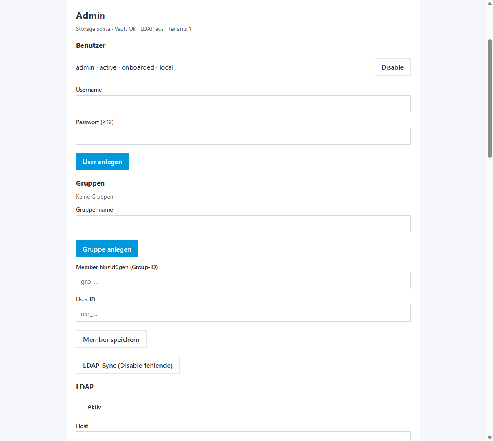

# teamVault – Admin Guide

Betrieb und Verwaltung der Instanz. Für den Alltag der Endanwender: [User Guide](user-guide.md).

## 1. Rollen

| Rolle | Rechte (Auszug) |
|-------|-----------------|
| `platform_admin` | Tenants, Storage-Migration, plattformweite Übersicht |
| `tenant_admin` | User, Gruppen, LDAP, SMTP, Policy, Audit, API-Keys, Escrow-Pubkey |
| `member` | Vault nur für eigene/geteilte Secrets |

Der erste User aus dem Setup-Wizard erhält **beide** Admin-Rollen.

## 2. Erstinstallation

### 2.1 Voraussetzungen

- Go 1.23+ **oder** Docker
- Persistentes Datenverzeichnis
- Unlock-Keyfile ≥ **32 Byte** hohe Entropie (kein Passwort)

### 2.2 Unlock-Key

```powershell
# Beispiel
openssl rand -out unlock.key 48
$env:TEAMVAULT_MASTER_UNLOCK_KEY_FILE = ".\unlock.key"
```

Der Key entsperrt nur die Config-DB. Vault-Secrets bleiben Zero-Knowledge.

### 2.3 Start

```powershell
go run ./cmd/teamvault -addr :8080
# oder
docker compose up -d --build
```

Browser: `/setup` — solange `initialized=false`.

### 2.4 Setup-Wizard

| Schritt | Inhalt |
|---------|--------|
| Willkommen | Kurzinfo Zero-Knowledge |
| Storage | SQLite (Default) oder JSON-File |
| Tenant/Admin | Erster Tenant + lokaler Admin (≥12 Zeichen Login-Passwort) |
| Krypto | Argon2id-Parameter (clientseitige Vault-KDF) |
| Recovery | `user_kit` und/oder Escrow erlaubt |
| Commit | Atomare Initialisierung |

#### Storage


#### Tenant & lokaler Admin


#### Argon2id (Vault-KDF)


#### Key-Recovery


#### Review & Commit


Nach dem Commit: Login → **Vault-Onboarding** (Master-Passwort) → App.

## 3. Admin-UI (nach Vault-Entsperren)

Tab **Admin** (sichtbar für `tenant_admin` / `platform_admin`; Auditoren nur Audit).



### 3.1 Benutzer

- Lokale User anlegen (Username + Login-Passwort ≥12)
- Status: active / disabled, Onboarding-Status, Auth-Backend (`local` / `ldap`)
- Disable statt Löschen (LDAP-Sync deaktiviert fehlende Accounts)

Kein Zugriff auf Master-Passwort, Private Keys oder Recovery-Kit-Klartext.

### 3.2 Gruppen

- Gruppen anlegen, Members über Group-ID (`grp_…`) + User-ID (`usr_…`)
- Rechte/Sharing bleiben über lokale Zuordnung — **keine** LDAP-Gruppen-Autorisierung
- Secrets können an Gruppen geteilt werden (pro Mitglied eigener Envelope) — siehe User Guide

### 3.3 LDAP / AD

Im Admin-Panel unter **LDAP** (unterhalb Benutzer/Gruppen im Screenshot):

- Optional, **nur Login-Bind** (nie Autorisierung)
- Felder: Host, Port, Base DN, Bind DN/Passwort, User-Filter
- Test-Bind, Speichern, LDAP-Sync (fehlende → lokal disabled)
- Just-in-Time: erster erfolgreicher LDAP-Login legt lokalen User an (`auth_backend=ldap`)

### 3.4 SMTP

- Outbound-Mail (Einladungen/Hinweise je nach Ausbau)
- Host, Port, From, Credentials; Test-Button

### 3.5 Krypto & Policy

- Argon2-Defaults / Presets für neue Onboardings
- TOTP-Pflicht (Hinweis/Policy nach Login)
- Idle-Lock der Vault-Session (Default 15 min) — nur Client-Unlock

### 3.6 Escrow & Shamir

Wenn Recovery-Modus Escrow erlaubt (Wizard-Schritt Recovery bzw. später umschalten mit Bestätigung `REONBOARD`):

1. In der Admin-UI **Escrow-Keypair + Shares** erzeugen (clientseitig)
2. Server speichert **nur** den Public Key
3. Private Shares offline verteilen (`k` von `n`); alternativ `tvcli escrow-split` / `escrow-combine`

Der private Escrow-Key darf nie in Logs oder dauerhaft auf dem Server landen.

### 3.7 Audit & API-Keys

- Audit-Liste (Tenant-Ereignisse)
- API-Keys für Automation/CLI (`Authorization: Bearer …` / `TEAMVAULT_API_KEY`) — Token nur einmal anzeigen

### 3.8 Tenants & Storage-Migration (`platform_admin`)

- Weitere Tenants anlegen
- Migration SQLite ↔ JSON: nur Ciphertext; Bestätigung `MIGRATE`

## 4. Docker & Package

Siehe Root-[README](../README.md#docker). Compose mountet:

- Volume `/data` — Vault/Config
- Unlock-Datei → `/run/secrets/teamvault_unlock` (read-only)

CI baut Images auf dem Ubuntu-Runner und pusht ins Gitea-Package-Registry (`.gitea/workflows/ci.yml`).

## 5. Backup

| Was | Hinweis |
|-----|---------|
| Datenverzeichnis / Volume | Enthält nur Ciphertext + Metadaten |
| Unlock-Keyfile | Separat, streng schützen — ohne Key keine Config |
| Escrow-Shares / User-Recovery-Kits | Offline, nie zusammen mit Unlock-Key lagern |

## 6. Netzwerk & TLS

- App lauscht typischerweise hinter Reverse-Proxy mit TLS
- Bind: `TEAMVAULT_ADDR` / `-addr` (Default `:8080`)
- Passkeys brauchen HTTPS (bzw. `localhost`) und korrekte Relying-Party-URL

## 7. Troubleshooting

| Symptom | Check |
|---------|--------|
| Start schlägt fehl „missing unlock key“ | `TEAMVAULT_MASTER_UNLOCK_KEY_FILE` gesetzt und lesbar? |
| Setup erscheint erneut | Falsches Data-Dir oder Unlock-Key? |
| LDAP-Login fehl | Test-Bind; Filter; User lokal nicht disabled |
| Passkey funktioniert nicht | HTTPS, RP-ID, Browser-Support |
| Vault „Idle gesperrt“ | Erneut Master-Passwort; Idle-Minuten in Policy |

## 8. Weiterführend

- Sicherheitsregeln: [`.cursor/rules/security-principles.mdc`](../.cursor/rules/security-principles.mdc)
- Admin-UI Scope (Planung): [planning/admin-ui-scope.md](planning/admin-ui-scope.md)
- OpenAPI: [openapi.yaml](openapi.yaml)
