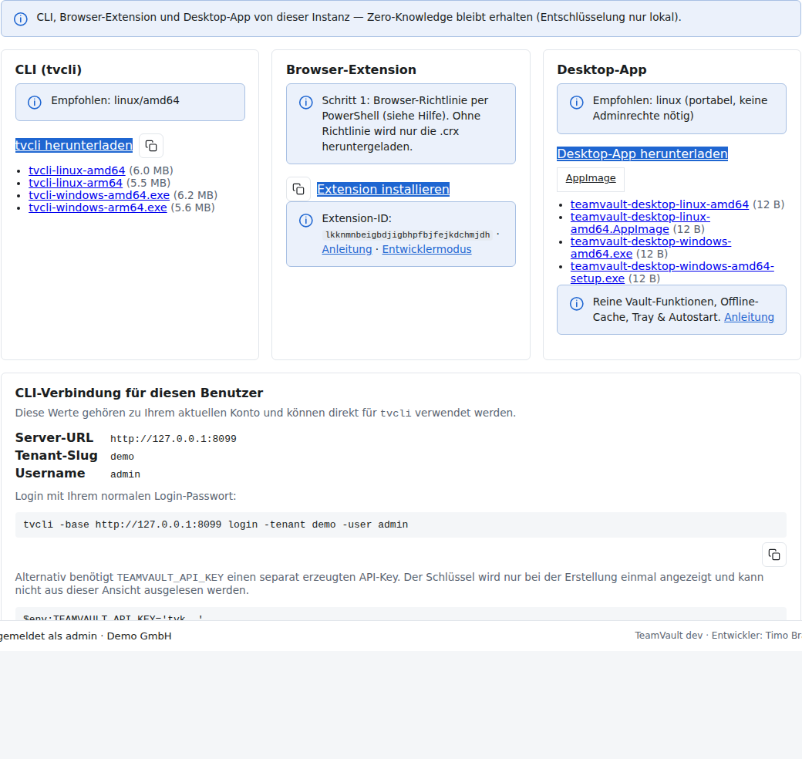

# TeamVault CLI (`tvcli`) – Kurzanleitung

Step-by-step für Endanwender. Interaktive Fassung auf der laufenden Instanz: **`/help/cli`**.



## Installation

### Einzeiler

**Windows (PowerShell):**

```powershell
$env:TEAMVAULT_URL='https://IHRE-VAULT-URL'; irm "$env:TEAMVAULT_URL/help/install/tvcli.ps1" | iex
```

**Linux:**

```bash
curl -fsSL "https://IHRE-VAULT-URL/help/install/tvcli.sh" | TEAMVAULT_URL="https://IHRE-VAULT-URL" bash
```

Die Skripte laden das Binary von `https://…/downloads/` (im Docker-Image automatisch bereitgestellt).

In der Web-App: **Konto → Clients** oder Hilfe **`/help/cli`** — Download und Installations-Einzeiler für Ihre Instanz.

### Manuell

1. Passende Datei von `/downloads/` holen (`tvcli-windows-amd64.exe`, `tvcli-linux-amd64`, …).
2. Ausführbar machen / in den PATH legen.

Admin-Build: `scripts/build-tvcli.ps1` bzw. `scripts/pack-clients.ps1` → nach `<data-dir>/downloads/` kopieren.

CI: Bei Release-Tags (`v*`) bauen `.github/workflows/tvcli.yml` (GitHub) bzw. `.gitea/workflows/tvcli.yml` (Gitea) die vier Standalone-Binaries und hängen sie an das Release.

## Einrichten

```powershell
tvcli -base https://IHRE-VAULT-URL login -tenant demo -user admin
```

Oder API-Key (Admin → API-Keys, Scope `read` / `vault`):

```powershell
$env:TEAMVAULT_API_KEY = "tvk_…"
tvcli -base https://IHRE-VAULT-URL whoami
```

## Nutzen

```powershell
tvcli secrets list
tvcli secrets get -id sec_…
tvcli secrets create -title "VPN" -username alice
tvcli secrets update -id sec_… -title "VPN neu" -notes "…"
```

Master-Passwort wird bei Bedarf **nur lokal** abgefragt.
