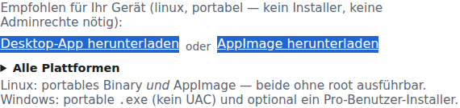
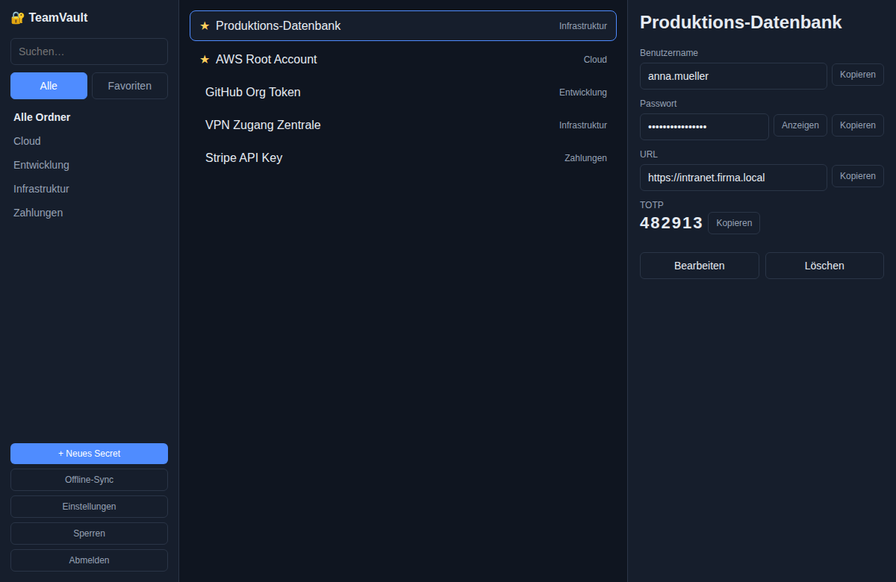

# TeamVault Desktop – Kurzanleitung

Native Desktop-App für Linux und Windows (Wails v2 / Go). **Reine Vault-Funktionen** — keine Konto-&-Sicherung- oder Administrations-Screens; diese bleiben der Web-UI vorbehalten. Nutzt denselben Zero-Knowledge-Server (REST-API) wie Web-UI, `tvcli` und die Browser-Extension: Entschlüsselung findet ausschließlich lokal im Desktop-Prozess statt, niemals auf dem Server.

Interaktive Fassung auf der laufenden Instanz: **`/help/desktop`**.


Download: In der Web-App unter **Konto & Sicherheit → Clients** oder Hilfe **`/help/desktop`** — empfohlenes Artefakt für die erkannte Plattform, alternative Artefakte (AppImage/Installer) sowie alle Downloads (sichtbar nur, wenn der Plattform-Administrator die Desktop-Integration unter **Administration → Client-Integrationen** aktiviert hat; `/downloads/` bleibt immer verfügbar).



## Was die App kann

| Bereich | Funktion |
|---------|----------|
| Vault | Secrets ansehen/anlegen/bearbeiten/löschen, Suche, Tag-Filter, Favoriten, TOTP-Code-Anzeige |
| Sharing | Eigene und mit mir geteilte Secrets werden unterschieden (Filter „Eigene“/„Geteilt“); Freigaben an Nutzer/Gruppen verwalten (hinzufügen, Capability wählen, entziehen), fehlende Gruppen-Schlüssel nachschlüsseln |
| Darstellung | Theme in den Einstellungen wählbar: **Systemeinstellung** (folgt automatisch der Betriebssystem-Präferenz, live), **Hell** oder **Dunkel** — Farben/Radius/Schrift analog zur Web-UI |
| Offline | Ciphertext-Snapshot lokal zwischengespeichert (max. 30 Tage) — Lesen ohne Netzwerk möglich; Anlegen/Ändern/Löschen/Freigabe-Verwaltung nur online |
| Tray | Icon in der Systemleiste: Öffnen / Sperren / Beenden; Fenster schließen minimiert optional in den Tray statt zu beenden |
| Autostart | Ein/Aus in den Einstellungen — ganz ohne Admin-/Root-Rechte |

**Nicht enthalten** (bewusst — dafür Web-UI nutzen): Onboarding/Registrierung, Passwort-/2FA-Selbstverwaltung, jegliche Tenant- oder Plattform-Administration.

> Hinweis: Die frühere Ordner-Navigation der Desktop-App wurde entfernt und durch das Tag-Modell der Web-App ersetzt (mehrere Tags pro Secret, UND-verknüpfter Tag-Filter in der Seitenleiste).

## Installation (ohne Adminrechte)

### Windows

1. `teamvault-desktop-windows-amd64.exe` vom Release herunterladen.
2. Direkt ausführen (portable — kein Installer nötig, kein UAC-Prompt).
3. Optional: `teamvault-desktop-windows-amd64-setup.exe` — Installer im **Pro-Benutzer-Modus** (schreibt nur ins Benutzerprofil `%LOCALAPPDATA%`, keine Adminrechte erforderlich).

### Linux

1. Portables Binary: `teamvault-desktop-linux-amd64` herunterladen, `chmod +x`, ausführen.
2. **Oder** AppImage: `teamvault-desktop-linux-amd64.AppImage` herunterladen, `chmod +x`, ausführen — keine Installation, kein root nötig.

WebKitGTK (`libwebkit2gtk-4.1`) muss auf dem System vorhanden sein (auf den meisten Desktop-Distributionen bereits installiert); die AppImage-Variante bündelt keine System-Bibliotheken wie GTK/WebKit selbst.

## Erste Schritte

1. **Server-URL + Mandant** eingeben → „Weiter“.
2. **Login** (Benutzername/Passwort, ggf. TOTP-Code) — identisch zum Web-Login.
3. **Master-Passwort** zum Entsperren des Vaults (verlässt nie das Gerät).
4. Vault-Liste: Suche, Tag-Filter, Favoriten, Filter „Eigene“/„Geteilt“, Secret öffnen zum Ansehen/Kopieren/TOTP/Freigabe-Verwaltung.



Nach jedem erfolgreichen Online-Entsperren wird automatisch ein Ciphertext-Snapshot lokal aktualisiert (Einstellungen → „Offline-Sync“ auch manuell möglich).

## Offline nutzen

- Ohne Netzwerkverbindung: „Offline öffnen“ auf dem Verbinden-Bildschirm, dann Master-Passwort eingeben.
- Es wird ein gelber **Offline-Modus**-Hinweis angezeigt; Anlegen/Ändern/Löschen/Freigabe-Verwaltung ist deaktiviert, bis wieder online entsperrt wurde.
- Cache-Gültigkeit: 30 Tage seit letztem Online-Sync (wie die Offline-PWA des Web-UI, siehe [`offline-vault.md`](planning/offline-vault.md)).
- In den Einstellungen kann die lokale Offline-Kopie jederzeit gelöscht werden.

## Tags & Sharing

- **Tags** ersetzen die frühere Ordner-Ablage: In der Seitenleiste listet die App alle im Vault verwendeten Tags auf; ein Klick aktiviert/deaktiviert den jeweiligen Filter (UND-Verknüpfung bei mehreren aktiven Tags), „Filter leeren“ setzt die Auswahl zurück. Tags werden beim Anlegen/Bearbeiten eines Secrets kommagetrennt eingegeben.
- **Eigene vs. geteilte Secrets**: Die Filterleiste unterscheidet „Eigene“ und „Geteilt“; geteilte Einträge zeigen zusätzlich den Ersteller in der Liste an.
- **Freigabe verwalten**: In der Secret-Detailansicht öffnet der Button „Freigabe verwalten“ eine eigene Ansicht mit den aktuellen Nutzer-/Gruppen-Freigaben (inkl. Rechtestufe: Lesen/Bearbeiten/Freigeben/Admin), einem Formular zum Hinzufügen weiterer Freigaben sowie der Möglichkeit, bestehende Freigaben zu entziehen. Neu beigetretene Gruppenmitglieder ohne eigenen Schlüssel werden unter „Fehlende Gruppen-Schlüssel“ angezeigt und können dort direkt nachgeschlüsselt werden.
- Diese Funktionen benötigen eine Online-Verbindung (Server-API-Aufrufe wie in der Web-App) und sind im Offline-Modus deaktiviert.

## Autostart & Tray

- **Einstellungen → Autostart**: registriert einen reinen Pro-Benutzer-Eintrag (Windows: `HKCU\...\Run`; Linux: `~/.config/autostart/*.desktop`) — kein root/Admin nötig, wirkt nur für den aktuellen Benutzer.
- **Tray-Icon**: Rechtsklick/Klick → Öffnen, Sperren, Beenden. „Schließen minimiert in den Tray“ ist in den Einstellungen umschaltbar.
- **Linux**: Das Tray-Icon nutzt dieselbe GTK-Hauptschleife wie das App-Fenster (AppIndicator). Auf Desktops ohne AppIndicator-Unterstützung kann es mit `TEAMVAULT_NO_TRAY=1` deaktiviert werden — die App startet dann ohne Tray-Symbol.
- **Design**: In den Einstellungen zwischen **Systemeinstellung**, **Hell** und **Dunkel** wählen; die Auswahl wird sofort angewendet und dauerhaft gespeichert. Bei „Systemeinstellung“ reagiert die App live auf Änderungen der Betriebssystem-Theme-Einstellung.

## Selbst bauen

```bash
./scripts/build-desktop.sh        # Linux: Binary + AppImage
```

```powershell
.\scripts\build-desktop.ps1              # Windows: portable .exe
.\scripts\build-desktop.ps1 -Installer   # zusätzlich Pro-Benutzer-NSIS-Installer
```

Quellcode: [`clients/desktop`](../clients/desktop) (eigenes Go-Modul, referenziert `internal/cryptocore` des Hauptmoduls). CI (Tag `v*`): `.github/workflows/release.yml`, Jobs `desktop-linux` / `desktop-windows`.
