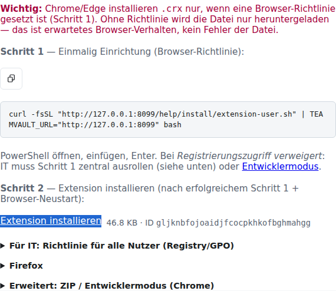

# TeamVault Browser-Extension – Kurzanleitung

Step-by-step für Endanwender. Interaktive Fassung: **`/help/extension`** auf Ihrer Instanz.



## Installation (normal, empfohlen)

Ohne Entwicklermodus: einmal kurz einrichten, danach wie aus dem Browser-Store installieren.

1. **`/help/extension`** oder **Konto → Clients** öffnen.
2. **Schritt 1 — Einrichtung:** PowerShell-Einzeiler ausführen (setzt Browser-Richtlinie für Ihren Benutzer):

```powershell
$env:TEAMVAULT_URL='https://IHRE-VAULT-URL'; irm "$env:TEAMVAULT_URL/help/install/extension-user.ps1" | iex
```

3. **Schritt 2 — Installieren:** Auf **Extension installieren** klicken (lädt `.crx` von `/downloads/`). Chrome/Edge zeigen den üblichen Installationsdialog.

**IT (alle PCs):** Einmalig als Administrator:

```powershell
$env:TEAMVAULT_URL='https://IHRE-VAULT-URL'; irm "$env:TEAMVAULT_URL/help/install/extension-policy.ps1" | iex
```

Richtlinien-Vorlagen liegen auch unter `/downloads/extension/chrome-policy.json` und `chrome-install-sources.json`.

### Wenn PowerShell blockiert ist (Antimalware / Firmenrichtlinie)

`irm … | iex` wird in vielen Umgebungen von Antimalware oder App-Control blockiert — das ist normal.

**Endanwender (Schritt 2):** In `/help/extension` oder **Konto → Clients** auf **Extension installieren** klicken — dafür ist kein PowerShell nötig, sobald die Browser-Richtlinie gesetzt ist.

**Schritt 1 ohne Pipe:**

1. Im Browser `$Base/help/install/extension-user.ps1` öffnen → **Speichern unter**
2. In einer PowerShell (nicht als Pipe):  
   `$env:TEAMVAULT_URL='https://IHRE-VAULT-URL'; powershell -NoProfile -ExecutionPolicy Bypass -File .\extension-user.ps1`

Wenn auch das blockiert wird: **IT** rollt die Vorlagen von `/downloads/extension/chrome-policy.json` und `chrome-install-sources.json` per GPO/Intune aus (ohne Skript).

### Linux / macOS

```bash
curl -fsSL "https://IHRE-VAULT-URL/help/install/extension-user.sh" | TEAMVAULT_URL="https://IHRE-VAULT-URL" bash
```

Chrome/Edge unter Linux benötigen ebenfalls IT-Richtlinien. Firefox: XPI über `policies.json` oder temporär `about:debugging`.

## Erweitert: Entwicklermodus (Fallback)

Nur wenn die normale Installation nicht möglich ist:

```powershell
$env:TEAMVAULT_URL='https://IHRE-VAULT-URL'; irm "$env:TEAMVAULT_URL/help/install/extension.ps1" | iex
```

```bash
curl -fsSL "https://IHRE-VAULT-URL/help/install/extension.sh" | TEAMVAULT_URL="https://IHRE-VAULT-URL" bash
```

Lädt `teamvault-extension.zip`, entpackt lokal, dann **Entpackte Erweiterung laden** in `chrome://extensions`.

## Einrichten

1. Popup öffnen → Server-URL = Ihre TeamVault-URL.
2. Bei HTTPS: optionale Host-Berechtigung für die Domain erlauben.
3. Login (Tenant / User / Passwort) → Master-Passwort (nur lokal).

## Nutzen

1. Seite öffnen, die zur Secret-URL passt.
2. Popup → Eintrag filtern (Alle / Privat / Geteilt) → **Fill** oder **Copy**.
3. Ohne URL im Secret: Fill/Copy erlaubt. Mit URL: Aktion nur bei Domain-Match (Phishing-Schutz).

Admin: `scripts/pack-clients.ps1` erzeugt CLI + Extension-Artefakte (`dist/`) → im Docker-Image unter `/opt/teamvault/bundled-downloads`.
