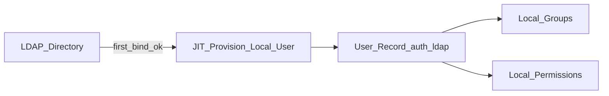

# TeamVault – Admin-UI Scope

**Status:** Planungsdokument (Teil B)  
**UI-Farben:** [`ui-brand.md`](ui-brand.md) (flach/modern; Palette storage-dashboard)

---

## 1. Rollen (freigegeben, OQ-06/08)

| Rolle | Scope |
|-------|-------|
| `platform_admin` | Instanzweit: Tenants anlegen/deaktivieren, Storage-Migration, plattformweite Health |
| `tenant_admin` | Tenant-Einstellungen, User, Gruppen, LDAP (pro Tenant), Recovery-Modus, Audit Tenant |
| `member` | Kein Admin-UI; Vault-UI |
| `auditor` | Später (nicht MVP): read-only Audit |

Setup-User erhält `platform_admin` **und** `tenant_admin`.

---

## 2. Vollständige Bereichsliste

### 2.1 Übersicht / Health

- Status Storage-Backend, letzte Migration, Config-Unlock OK
- LDAP-Verbindungsstatus (ohne Secrets)
- Queue/Mail-Fehler falls vorhanden

### 2.2 Tenants

- Anlegen / Umbenennen / Deaktivieren
- Tenant-Settings: 2FA-Pflicht, Argon2-Defaults, Session-/Unlock-Timeouts (OQ-17), Recovery-Modus
- `escrow_allowed`: Escrow-Option deaktivierbar → nur `user_kit` (OQ-15)
- Wechsel Recovery-Modus: Bestätigung + Audit + **Pflicht-Re-Onboarding** aller User (OQ-03)

### 2.3 Lokale User-Verwaltung

- Anlegen, Bearbeiten, Deaktivieren lokaler User (unabhängig von LDAP)
- Login-Passwort setzen/resetten (nur `auth_backend=local`)
- Rolle zuweisen
- Anzeige: Onboarding-Status (`pending` / `complete`)
- **Kein** Zugriff auf Master-Passwort, Private Keys, Recovery-Kit-Klartext

### 2.4 Gruppenverwaltung (lokal)

- Gruppen CRUD
- Mitglieder zuordnen (lokale **und** LDAP-provisionierte User gleichartig)
- Keine LDAP-Gruppen-Sync für Rechte

### 2.5 LDAP/AD-Verbindungen

- Mehrere Verbindungen **pro Tenant** (OQ-09)
- CRUD: Host, TLS, Bind, Base-DN, Filter
- Test-Bind
- Aktiv/Inaktiv
- Periodischer Sync (Default täglich): fehlende LDAP-Accounts → lokaler User `disabled` (nicht löschen) (OQ-11)
- Bei Auto-Disable: Pflicht-Rotation nur wenn User alleiniger Secret-Owner; sonst Rechteentzug + Key-Rotation (Prinzip 7)
- Secrets nur Schreibfelder (nie zurücklesen im Klartext)

### 2.6 LDAP-User-Integration

**Modell (fest laut Anforderung):**

1. LDAP dient nur der Login-Authentifizierung (Bind).
2. Beim **ersten erfolgreichen LDAP-Login**: Just-in-Time-Provisionierung → User-Datensatz lokal mit `auth_backend=ldap`.
3. Danach erscheint der User in derselben User-Liste wie lokale User.
4. Zuordnung zu **lokalen** Gruppen über dieselbe UI.
5. Optional: manueller/geplanter LDAP-User-Import (Preview + Select) über Admin-UI – erzeugt `pending`-User ohne Onboarding bis erster Login.



Autorisierung = lokal. LDAP-Gruppenmitgliedschaften werden im MVP **komplett ignoriert** (OQ-10); Datenmodell bleibt für spätere Info-Anzeige erweiterbar.

### 2.7 Mail / SMTP

- SMTP-Einstellungen, Test-Mail
- Vorlagen für Einladung / „Account disabled“ (ohne Secret-Inhalte)

### 2.8 Storage-Backend & Migration

- Aktuelles Backend anzeigen
- Neues Backend konfigurieren
- Migrations-Wizard gemäß [`storage-abstraction.md`](storage-abstraction.md)
- Besonders strikte Bestätigungen (Datenverlustrisiko)

### 2.9 Verschlüsselungsparameter

- Tenant-Argon2id-Defaults anpassen
- Hinweis: betrifft neue Ableitungen / MP-Wechsel; bestehende Ciphertexts bleiben gültig bis User Keys neu siegeln

### 2.10 Key-Recovery (Admin)

- Modus anzeigen/umschalten (mit Re-Onboarding)
- Escrow optional deaktivierbar
- Bei Escrow: Share-Status (k/n, Default 3-of-5), Recovery-Ritual, auditiert; Share-Holder MVP nur Personen (OQ-13)
- Bei User-Kit: nur Policy-Texte; kein Kit-Abruf

### 2.11 Audit-Log

- Filter: User, Aktion, Zeitraum, Resource
- Export (CSV/JSON) ohne Secret-Klartext
- Tamper-Evident soweit praktikabel (append-only)

### 2.12 API-Key-Verwaltung

- Erzeugen (Klartext **einmal** zeigen), widerrufen, Scopes, Expiry
- Scopes: `read` | `vault` | `admin` (Pflicht, mind. einer; UI-Checkboxen)
- Gehashte Speicherung; Enforcement in `requireAuth`

### 2.13 2FA Policy

- TOTP Pflicht/Optional (Phase 4, Pflicht-Baseline für Prod)
- Passkeys: nicht im ersten Prod-Release (OQ-20); später nur Login, nie Vault-Unlock (OQ-04)

---

## 3. Zusammenführung lokale Gruppen und LDAP-User

| Frage | Antwort |
|-------|---------|
| Getrennte User-Tabellen? | Nein – eine `users`-Tabelle |
| Unterscheidung | Attribut `auth_backend` |
| Gruppen | Nur lokale Gruppen; Membership-Tabelle ohne Auth-Unterschied |
| Rechte | Permissions auf User/Gruppe – unabhängig vom Auth-Backend |
| Deaktivierung | Lokal `status=disabled` blockiert Login auch wenn LDAP-Account noch existiert |
| LDAP-Account gelöscht | Periodischer Sync setzt `disabled`; Login schlägt zusätzlich fehl; Rotation gemäß OQ-11 |

---

## 4. Explizit außerhalb Admin-UI

- Anzeige/Export von Vault-Klartext-Secrets
- Serverseitiges „Passwort entschlüsseln“
- Weitere Env-Vars für LDAP/SMTP (nur Config-DB)
- Bitwarden-Admin-Kompatibilität

---

## 5. Navigationsskizze (flach)

```text
Admin
├── Übersicht
├── Tenants
├── Benutzer
├── Gruppen
├── LDAP
├── E-Mail
├── Storage
├── Krypto & Recovery
├── Audit
└── API-Keys
```

Visuell: Accent für Primäraktionen, Primary für destruktive Aktionen – siehe [`ui-brand.md`](ui-brand.md).

---

## 6. Verwandte Dokumente

- [`architecture.md`](architecture.md)
- [`setup-wizard-flow.md`](setup-wizard-flow.md)
- [`crypto-design.md`](crypto-design.md)
- [`open-questions.md`](open-questions.md)
