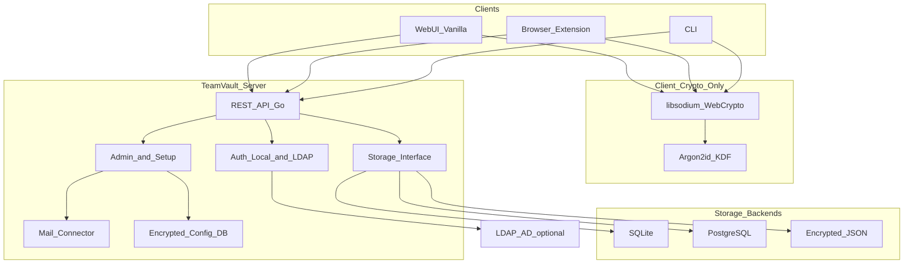
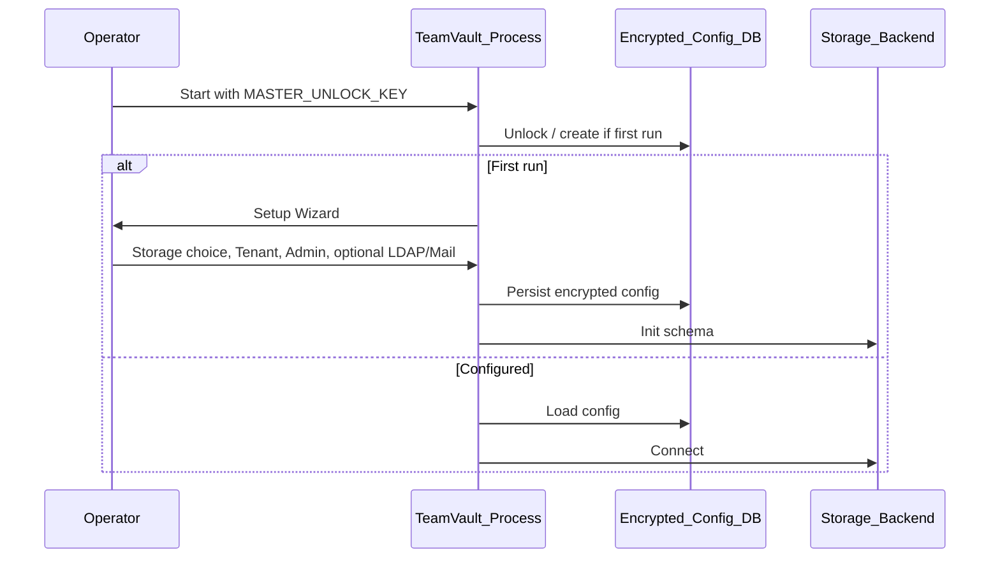

# TeamVault – Architektur

**Status:** Planungsdokument (Teil B) – freigegeben inkl. PO-Antworten in [`open-questions.md`](open-questions.md)  
**Produkt:** TeamVault – interner Multi-Tenant-Passwortmanager  
**Branding:** Farbtokens in [`ui-brand.md`](ui-brand.md) (storage-dashboard-Palette; MVP Light only)

---

## 1. Ziele und Abgrenzung

TeamVault ist ein self-hosted Pendant zu Passbolt/Vaultwarden für interne Netze (auch ohne Internetanbindung). Multi-Tenant-fähig, containerbasiert, Administration vollständig über Web-UI. Authentifizierung lokal und optional LDAP/AD (nur Login-Bind). Vault-Kryptografie ausschließlich clientseitig (Zero-Knowledge).

**Nicht im Scope dieses Dokuments:** Implementierungsdetails, Container-Images, OpenAPI – folgen in Teil C.

---

## 2. Tech-Stack (freigegeben, OQ-01 – Nachtrag Go)

| Schicht | Wahl | Begründung |
|---------|------|------------|
| Backend | **Go** (`net/http` oder Chi/Echo) | Einfachere Toolchain, starke Stdlib (crypto, sql), Single Binary für Air-Gap |
| Frontend | Vanilla JS (`web/static`, eingebettet) | Kein Node-Build in Runtime; Air-Gap; OQ-01 Nachtrag: kein React-Rewrite |
| Client-Crypto | `internal/cryptocore` (Go, Phase 2) + später Browser/WASM-Port | Argon2id, X25519 box, AES-256-GCM; Server darf Vault nicht entschlüsseln |
| Storage | SQLite (`modernc.org/sqlite`) Default; JSON-File als Fallback | Austauschbar zur Laufzeit über Admin-UI |
| Clients | Eigene WebExtension + minimales CLI | Gegen dieselbe REST-API; gemeinsames Crypto-Kernmodul |

---

## 3. Komponentendiagramm

### Komponentenrollen

| Komponente | Verantwortung | Sieht Klartext-Secrets? |
|------------|---------------|-------------------------|
| WebUI / Extension / CLI | UX, clientseitige Ver-/Entschlüsselung, Session mit Master-Key nur im Speicher | Ja (nur lokal im Client) |
| Crypto-Modul (shared) | Argon2id, Keypair, AES-256-GCM / Secretbox, Sharing-Hüllen | Nur im Client |
| REST-API | Auth-Session, CRUD-Metadaten, Ciphertext-Persistenz, Audit | Nein |
| Auth | Lokaler Passwort-Hash-Check bzw. LDAP-Bind; Session-Tokens | Nur Login-Passwort transient bei lokalem Hash-Check; nie Vault-Master-PW |
| LDAP-Connector | Bind-Request gegen Verzeichnis | Nur LDAP-Credentials transient |
| Mail-Connector | SMTP für Einladungen/Alerts (keine Secret-Bodies) | Nein |
| Storage-Interface | Backend-agnostische Persistenz | Nur Ciphertext + Metadaten |
| Config-DB | Verschlüsselte App-Konfiguration, entsperrt via `MASTER_UNLOCK_KEY` | Konfig-Secrets nach Unlock im Prozessspeicher |

---

## 4. Multi-Tenancy-Modell

### Entscheidung (freigegeben, OQ-02)

**Tenant-ID auf jeder tenant-gebundenen Tabelle** (Shared Schema, Row-Level Isolation), nicht getrennte DB-Schemas pro Tenant. Isolation wird durch Query-Guards + harte Tests durchgesetzt.

### Begründung

- Ein Storage-Backend, eine Migrationspipeline, einfachere Backup-/Migrationspfade über die Admin-UI.
- Strikte Filterung: jeder Query-Pfad muss `tenant_id` setzen; Enforcement in der Storage-/Service-Schicht + Integrationstests.
- Tenant-übergreifende Operationen nur über Rolle `platform_admin`, explizit und auditiert.

### Trade-offs

| Ansatz | Vorteile | Nachteile |
|--------|----------|-----------|
| **Tenant-ID pro Zeile (gewählt)** | Einfache Ops, ein Schema, Backend-Wechsel einfacher | Bug-Risiko bei fehlendem Filter; braucht harte Tests/Guards |
| Schema-pro-Tenant | Stärkere DB-seitige Trennung | Komplexe Migrationen, Backup-Explosion, schwieriger Backend-Wechsel |
| DB-pro-Tenant | Maximale Isolation | Hoher Betriebsaufwand, widerspricht austauschbarem Storage |

---

## 5. Datenmodell (logisch)

Alle tenant-gebundenen Entitäten tragen `tenant_id` (UUID). Zeitstempel: `created_at` / `updated_at` (UTC). Soft-Delete nur wo Audit es erfordert; Secrets werden bei Entzug kryptografisch invalidiert (siehe Crypto-Design).

### 5.1 Tenant

| Feld | Typ | Hinweis |
|------|-----|---------|
| id | UUID | PK |
| name | string | Anzeigename |
| slug | string | unique |
| recovery_mode | enum | `user_kit` \| `admin_escrow` (pro Tenant; kein User-Opt-out, OQ-03) |
| escrow_allowed | bool | Wenn false: nur `user_kit` erlaubt (OQ-15) |
| argon2_params | JSON | memory, iterations, parallelism (Tenant-Default; Client-KDF + Login-Hash-Kosten, OQ-16) |
| session_timeout_secs | int | Default 8h (OQ-17) |
| vault_unlock_idle_secs | int | Default 15 min (OQ-17) |
| status | enum | `active` \| `disabled` |
| settings | JSON | Feature-Flags (2FA-Pflicht etc.) |

### 5.2 User

| Feld | Typ | Hinweis |
|------|-----|---------|
| id | UUID | PK |
| tenant_id | UUID | FK |
| username | string | unique pro Tenant |
| display_name | string | |
| email | string | optional |
| auth_backend | enum | `local` \| `ldap` |
| ldap_dn / ldap_source_id | string | nur bei LDAP |
| local_password_hash | string | nur bei `local`; **separat** vom Vault-Master-Passwort (z. B. Argon2id/server-side für Login) |
| status | enum | `active` \| `disabled` \| `pending_onboarding` |
| role | enum / set | `member` \| `tenant_admin` \| `platform_admin` (Setup-User: platform_admin + tenant_admin, OQ-06/08) |
| public_key | bytes | User-Public-Key (Vault); sichtbar serverseitig |
| encrypted_private_key | bytes | mit Master-Key vom Client verschlüsselt |
| encrypted_private_key_recovery | bytes | je nach Recovery-Modus |
| onboarded_at | timestamp | null bis Master-PW-Setup fertig |
| totp_secret_enc | bytes | optional; 2FA-Secret geschützt |
| webauthn_credentials | JSON | optional, nur Login |

**Wichtig:** `local_password_hash` authentifiziert nur den WebUI-Zugang. Das Vault-Master-Passwort verlässt den Client nie und wird serverseitig nicht gespeichert.

### 5.3 Gruppe (lokal)

| Feld | Typ | Hinweis |
|------|-----|---------|
| id | UUID | |
| tenant_id | UUID | |
| name | string | |
| description | string | |

Gruppenmitgliedschaft: `group_members(user_id, group_id, tenant_id)`. LDAP-Gruppen werden **nicht** für Autorisierung verwendet; LDAP-User werden nach Provisionierung wie lokale User lokalen Gruppen zugeordnet.

### 5.4 Collection

| Feld | Typ | Hinweis |
|------|-----|---------|
| id | UUID | |
| tenant_id | UUID | |
| name | string | |
| parent_id | UUID? | optionale Hierarchie |

Berechtigungen auf Collection- oder Secret-Ebene: `permissions(subject_type, subject_id, resource_type, resource_id, capability, tenant_id)` mit `capability ∈ {read, write, share, admin}`.

### 5.5 Secret (Vault-Eintrag)

| Feld | Typ | Hinweis |
|------|-----|---------|
| id | UUID | |
| tenant_id | UUID | |
| collection_id | UUID? | |
| title_ciphertext | bytes | **clientseitig verschlüsselt** (OQ-12); Server sieht keinen Klartext-Titel |
| ciphertext | bytes | AES-256-GCM Payload (Username/Password/Notes/…); Suche nur clientseitig |
| nonce / key_version | … | |
| created_by | UUID | |

### 5.6 Schlüssel-Ablage / Sharing

| Entität | Inhalt |
|---------|--------|
| `secret_key_envelopes` | Pro `(secret_id, user_id)`: Datenschlüssel mit User-Public-Key asymmetrisch verschlüsselt; `key_version` |
| `revoked_key_versions` | Ungültige Versionen nach Rechteentzug |
| `admin_escrow_shards` / `escrow_public_key` | Nur bei Recovery-Modus Admin-Escrow |

Details der Algorithmen: [`crypto-design.md`](crypto-design.md).

### 5.7 Audit-Log

Append-only: `actor_id`, `tenant_id`, `action`, `resource_type`, `resource_id`, `ip`, `user_agent`, `metadata` (keine Klartext-Secrets), `created_at`.

### 5.8 API-Keys

Maschinen-Zugang: gehashte Keys, Scope/Tenant, Expiry; nie Klartext nach Erstellung erneut anzeigbar.

---

## 6. Bootstrap und Konfiguration

- Genau ein externes Geheimnis: `MASTER_UNLOCK_KEY`.
- **Prod bevorzugt:** gemountetes Keyfile / Container-Secret (OQ-14); Env-Var nur Dev/Test-Fallback.
- Port/Bind optional per Env/Flag.
- Alle weiteren Secrets (SMTP, LDAP Bind-DN-Passwort, …) nur in der verschlüsselten Config-DB.

---

## 7. Sicherheitsgrenzen (Server vs. Client)

| Daten | Client | Server/DB |
|-------|--------|-----------|
| Vault-Master-Passwort | ja (transient) | nie |
| User Private Key (Klartext) | ja (transient nach Unlock) | nie |
| User Public Key | ja | ja |
| Secret-Titel / Collection-Namen | ja (nach Decrypt) | nie (ciphertext only, OQ-12) |
| Secret Klartext | ja (nach Decrypt) | nie |
| Secret Ciphertext | ja | ja |
| Login-Passwort (lokal) | transient | nur Hash |
| LDAP Bind | transient | Config verschlüsselt |

---

## 8. Client-Integrationen (später, Phase 8)

- Öffentliche REST-API (OpenAPI).
- WebExtension und CLI nutzen **ausschließlich** das Crypto-Kernmodul aus Phase 2 – keine duplizierte Kryptologik.
- Keine Bitwarden-Protokoll-Kompatibilität.

---

## 9. Verwandte Dokumente

- [`crypto-design.md`](crypto-design.md)
- [`storage-abstraction.md`](storage-abstraction.md)
- [`setup-wizard-flow.md`](setup-wizard-flow.md)
- [`admin-ui-scope.md`](admin-ui-scope.md)
- [`ui-brand.md`](ui-brand.md)
- [`open-questions.md`](open-questions.md)
