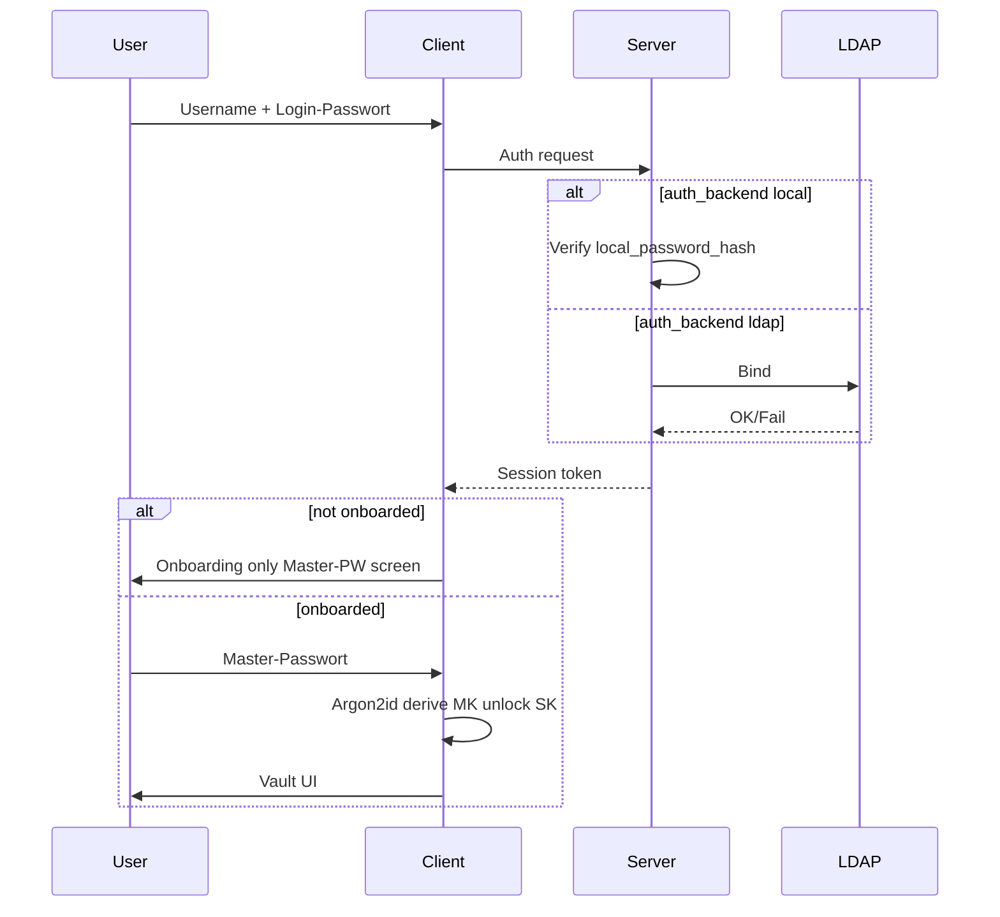

# TeamVault – Crypto-Design

**Status:** Planungsdokument (Teil B)  
**Bezug:** Sicherheitsprinzipien 1–5, 7, 9, 10

---

## 1. Primitive (nur etablierte Bibliotheken)

| Zweck | Algorithmus | Bibliothek |
|-------|-------------|------------|
| Master-Passwort → Key | Argon2id | libsodium / argon2 (Client) |
| User-Schlüsselpaar | X25519 (Key Exchange) + Ed25519 optional für Signaturen | libsodium |
| Secret-Payload | AES-256-GCM oder XChaCha20-Poly1305 | WebCrypto / libsodium |
| Sharing-Hülle | crypto_box (Public-Key) des Datenschlüssels pro Empfänger | libsodium |
| Login-Passwort (Server) | Argon2id-Hash des **Login**-Passworts | Server (getrennt vom Vault-Master) |
| Admin-Escrow Split | Shamir’s Secret Sharing über Escrow-Master-Secret | etablierte Lib (z. B. `sss` / auditierte Variante) |

**Verboten:** eigene Primitives; PBKDF2/bcrypt/MD5/SHA1 allein als Vault-KDF.

---

## 2. Schlüsselhierarchie

```text
Master-Passwort (User, nie Server)
    └─ Argon2id(salt, params) → Master-Key (MK)
           ├─ unwrap → Private Key (SK_user)
           └─ (optional) Recovery-Kit Material

Datenschlüssel DK_secret (zufällig, pro Secret oder pro Key-Version)
    ├─ verschlüsselt Payload (AES-GCM / XChaCha20-Poly1305)
    └─ pro berechtigtem User: Envelope = crypto_box(DK, PK_user)
```

Bei Admin-Escrow zusätzlich:

```text
Escrow-Keypair (Tenant)
    └─ Envelope auch für Escrow-PK (wenn Modus aktiv und Policy es erlaubt)
Shamir: Escrow-SK in n Shares (k-of-n) an vertrauenswürdige Admins / Offline-Medien
```

---

## 3. Abläufe

### 3.1 Login (lokal oder LDAP)



- Login-Auth und Vault-Unlock sind **getrennt**.
- Session-Token berechtigt API-Zugriff; ohne MK/SK keine Secret-Entschlüsselung.

### 3.2 Erstanmeldung (Onboarding) – lokal und LDAP identisch

1. Erfolgreicher Login, `onboarded_at == null`.
2. Client erzwingt Master-Passwort (Stärke-Policy).
3. Client: Salt + Argon2id → MK; generiere Keypair; `encrypted_private_key = seal(SK, MK)`.
4. Je nach Tenant-`recovery_mode`:
   - **user_kit:** Recovery-Codes/Kit erzeugen; `encrypted_private_key_recovery` ablegen; Kit **einmal** anzeigen (Download/Print); Admin sieht Klartext-Kit nie.
   - **admin_escrow:** Zusätzliche Hülle der SK (oder Ableitung) für Escrow-PK; User bestätigt Risiko-Hinweis.
5. `public_key` + Ciphertexte an Server; Server setzt `onboarded_at`.
6. Erst danach Vault-Routen freigeschaltet.

### 3.3 Secret anlegen

1. Client generiert zufälligen `DK`.
2. Payload (Felder) → Ciphertext mit `DK`.
3. Envelope für Owner: `box(DK, PK_self)`.
4. Upload: Metadaten + Ciphertext + Envelope(s). Server speichert nur Ciphertext/Envelopes.

### 3.4 Secret teilen (Gruppe / User)

1. Owner entschlüsselt `DK` mit eigener SK.
2. Für **jeden** Ziel-User: neues Envelope `box(DK, PK_target)`.
3. Kein gemeinsames Gruppengeheimnis – Gruppenmitgliedschaft steuert nur, *für wen* Envelopes erzeugt werden.
4. Bei späteren Gruppenänderungen: fehlende Envelopes nur nach expliziter Bestätigung (TOFU) nachziehen bzw. bei Entzug rotieren (3.5).

### 3.5 Berechtigung entziehen (Pflicht-Rotation)

1. Neuen `DK'` generieren.
2. Payload mit `DK'` neu verschlüsseln.
3. Envelopes nur für **verbleibende** Berechtigte erzeugen (`key_version++`).
4. Alte Envelopes/Version ungültig markieren; Server darf alte Ciphertexts löschen oder als revoked führen.
5. Audit-Event `secret.key_rotated` / `permission.revoked` (Audit-Write fail → Mutation gilt serverseitig als fehlgeschlagen für den Client).

### 3.6 Master-Passwort wechseln

1. Unlock mit altem MP → SK im Speicher.
2. Neues MP → neues MK'; `encrypted_private_key` neu siegeln.
3. Recovery-Material gemäß Modus aktualisieren (neues Kit bzw. Escrow-Hülle erneuern).
4. Server speichert nur neue Ciphertexte der Key-Blobs – kennt MP nie.

### 3.7 Login-Passwort wechseln (nur lokale User)

Server-seitiger Hash-Update; **kein** Einfluss auf Vault-Keys (außer User wählt bewusst gleiches Geheimnis – UI warnt).

---

## 4. Key-Recovery

### 4.1 Umschaltbarkeit

**Vorschlag:** Recovery-Modus **pro Tenant** (`user_kit` | `admin_escrow`); kein User-Opt-out (OQ-03). Tenant kann `admin_escrow` per `escrow_allowed=false` verbieten (OQ-15). Moduswechsel erzwingt **Pflicht-Re-Onboarding** aller betroffenen User.

### 4.2 Modus A – User-Ebene (Recovery-Kit)

| Aspekt | Inhalt |
|--------|--------|
| Was | Einmalige Codes oder verschlüsseltes Kit, das SK bzw. MK-Wiederherstellung erlaubt |
| Wer | Nur der User; Admin hat keinen Generalschlüssel |
| Trade-off | Kein Admin-Backdoor; **Datenverlust**, wenn Kit + MP verloren |
| UX | Bei Onboarding erzwungenes Speichern/Bestätigen |

### 4.3 Modus B – Admin-Escrow

| Aspekt | Inhalt |
|--------|--------|
| Was | Tenant-Escrow-Keypair; User-Private-Key (oder MK-wrap) zusätzlich für Escrow-PK verschlüsselt |
| Wer | Tenant-Admins mit Escrow-Berechtigung |
| Trade-off | Wiederherstellung möglich; Escrow-SK ist **hochkritisches Asset** |
| Abschwächung SPOF | Shamir k-of-n: Escrow-SK nie als Ganzes online; Rekonstruktion nur in kontrolliertem Recovery-Ritual |

**Shamir (OQ-13):** Default 3-of-5, k/n durch Tenant-Admin konfigurierbar. MVP: nur menschliche Share-Holder; HSM später möglich, Architektur nicht verbauen. Recovery-Session auditiert; nach Recovery User muss MP neu setzen und Envelopes/Kit erneuern.

### 4.4 Gegenüberstellung

| Kriterium | User-Kit | Admin-Escrow |
|-----------|----------|--------------|
| Zero-Knowledge ggü. Admin | Ja | Nein (bei Recovery) |
| Schutz vor Admin-Missbrauch | Hoch | Abhängig von Share-Disziplin |
| Schutz vor User-Verlust | Niedrig | Hoch |
| Operative Komplexität | Niedrig | Hoch |

---

## 5. Was den Client niemals unverschlüsselt verlässt

| Datenobjekt | Verlässt Client unverschlüsselt? |
|-------------|----------------------------------|
| Vault-Master-Passwort | **Nein** |
| Abgeleiteter Master-Key (MK) | **Nein** |
| User Private Key (SK) | **Nein** |
| Secret-Payload (Passwort, Notes, …) | **Nein** |
| Datenschlüssel DK | **Nein** (nur in Envelopes) |
| Recovery-Kit Klartext | **Nein** (nur Anzeige lokal; Upload nur versiegelt) |
| User Public Key | Ja (absichtlich) |
| Ciphertext / Nonce / key_version | Ja |
| Titel / Collection-Namen | **Nein** (clientseitig verschlüsselt, OQ-12) |
| Login-Passwort | Transient an Server nur für lokalen Auth-Hash-Check bzw. LDAP-Bind (nicht Vault) |
| Argon2-Parameter / Salt | Ja (nicht geheim, aber integritätsrelevant) |

---

## 6. 2FA (TOTP)

- TOTP schützt den **Login** (zweite Stufe nach Login-Passwort/LDAP), nicht die Datenverschlüsselung.
- Nach erfolgreichem 2FA: Session wie bisher; Vault weiterhin nur mit Master-Passwort entsperrbar.
- TOTP-Secret: serverseitig nur verschlüsselt at-rest in Config-/User-Store (mit Server-Config-Key nach Unlock) – **nicht** mit User-MK, damit Login-2FA vor Vault-Unlock greift.
- Tenant-Policy: 2FA optional / Pflicht.

---

## 7. Passkey / WebAuthn (nach erstem Prod-Release, OQ-20)

- Passkeys ersetzen oder ergänzen den **Login**, **nicht** die Vault-Verschlüsselung (OQ-04).
- **Kein** „Unlock with platform authenticator“ (würde ZK verletzen).
- Ohne Master-Passwort (oder Recovery) keine Entschlüsselung historischer Ciphertexts.
- Erster Prod-Release: TOTP (Phase 4) reicht; Passkeys optional später.

---

## 8. Bedrohungsannahmen

Zero-Knowledge gilt gegenüber **Speicher und DB-Dump** und gegenüber einem ehrlichen Server, der Ciphertexts nur ablegt. Es gilt **nicht** gegenüber einem App-Server, der das Web-UI-JavaScript ausliefert (XSS, kompromittiertes Release, böswilliger Operator am Auslieferungskanal). In dem Modell kann der Client beliebige Schlüssel wrappen oder exfiltrieren; das ist physikalisch nicht zu schließen, solange Crypto im Browser läuft.

Geschlossene Pfade ohne JS-Manipulation:

| Bedrohung | Gegenmaßnahme |
|-----------|---------------|
| Kompromittierte DB / Storage-Dump | Nur Ciphertext; ohne User-SK nutzlos |
| Server vertauscht Empfänger-Pubkeys | TOFU-Fingerprint im Client (localStorage); Wrap nur nach Bestätigung bei neuem/geändertem Key |
| Stilles Gruppen-Catch-up (`afterUnlock` wrappt DKs) | Entfernt; Nachpflege nur mit sichtbarer Empfängerliste und Bestätigung |
| Böswilliger Tenant-Admin ohne Escrow-SK | Escrow-Pubkey ersetzen nur nach k-aus-n Challenge gegen den **aktuellen** Escrow-Key |
| Rechteentzug ohne Rotation | API + Client erzwingen DK-Rotation; alte Key-Version ungültig |
| XSS im WebUI | CSP; SK nur im Speicher; residual: kompromittiertes JS bricht ZK |
| Offline-Brute-Force auf `encrypted_private_key` | Argon2id-Kosten (user-eigene Params am Key-Blob) |

**Residualrisiko (OQ-22):** Ein Angreifer, der die ausgelieferte Web-App kontrolliert, umgeht alle clientseitigen Checks. Schutz: Release-Signatur, Subresource Integrity wo möglich, eingeschränkte Admin-Zugänge zum Host, Code-Review der Auslieferung.

---

## 9. Verwandte Dokumente

- [`architecture.md`](architecture.md)
- [`setup-wizard-flow.md`](setup-wizard-flow.md)
- [`open-questions.md`](open-questions.md)
