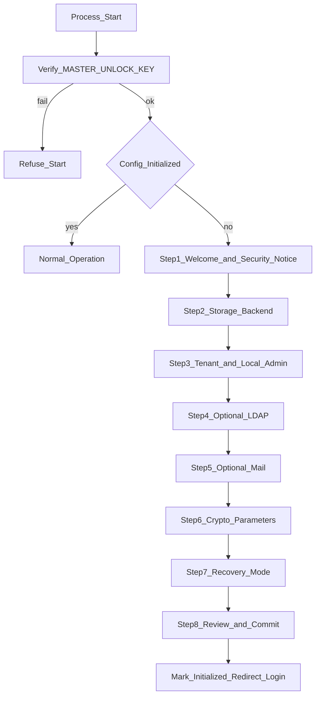

# teamVault – Setup-Wizard Flow

**Status:** Planungsdokument (Teil B)  
**Ziel nach Abschluss:** System nutzbar mit einem Tenant, lokalem Admin, SQLite, ohne LDAP.

---

## 1. Voraussetzungen

| Voraussetzung | Quelle |
|---------------|--------|
| `MASTER_UNLOCK_KEY` gesetzt | **Prod:** gemountetes Keyfile/Secret (OQ-14); Dev: Env-Var-Fallback |
| Prozess lauscht auf Bind/Port | Env/Flag optional |
| Noch keine abgeschlossene Config | First-Run-Erkennung |

Fehlt der Unlock-Key → Prozess startet nicht produktiv (klarer Fehler, kein Wizard mit unsicherem Default).

---

## 2. Gesamtablauf

Jeder Schritt hält den **Entwurf nur clientseitig** (Browser-Session), damit Reloads nichts verwerfen. Persistenz in verschlüsselter Config + Vault-Store erst bei **atomarem Commit** (Schritt 8, OQ-05) – kein serverseitiger `setup_incomplete`-Zustand.

---

## 3. Schrittdetails

### Schritt 1 – Willkommen & Security Notice

- Kurz: Zero-Knowledge, Client-Crypto, ein Bootstrap-Secret.
- Hinweis: Erster Admin ist **immer lokal** authentifiziert (Schutz vor LDAP-Aussperrung).
- UI: Branding gemäß [`ui-brand.md`](ui-brand.md).

### Schritt 2 – Storage-Backend

| Option | Eingaben |
|--------|----------|
| SQLite (Default) | Dateipfad (Default unter Data-Dir) |
| PostgreSQL | Host, Port, DB, User, Password, TLS-Optionen |
| Encrypted JSON | Verzeichnispfad |

- Connectivity-Test-Button vor Weiter.
- Passwörter nur in verschlüsselte Config, nie in Klartext-Logs.

### Schritt 3 – Erster Tenant + lokaler Admin

Pflichtfelder:

- Tenant-Name, Slug
- Admin-Username, Display-Name, E-Mail (optional)
- Admin-**Login**-Passwort (mit Bestätigung) → serverseitig gehasht
- `auth_backend = local` **fest**, nicht abwählbar in diesem Schritt

Nach Commit: Admin existiert als User mit **beide** Rollen `platform_admin` und `tenant_admin` (OQ-06/08).  
Vault-Onboarding (Master-Passwort) erfolgt **nach** erstem Login, nicht im Wizard (Wizard läuft oft ohne dass der Admin-Client schon Vault-Keys braucht; Keys entstehen clientseitig beim ersten Login).

### Schritt 4 – LDAP/AD (optional, überspringbar)

- Mehrere Verbindungen vorbereiten möglich, mindestens „keine“.
- Felder: Host, Port, TLS/StartTLS, Bind-DN, Bind-Password, Base-DN, User-Filter.
- Test-Bind.
- Hinweis: LDAP nur Login; Autorisierung lokal; Just-in-Time-Provisionierung später.

### Schritt 5 – Mail/SMTP (optional, überspringbar)

- Host, Port, TLS, User/Password, From-Address.
- Test-Mail an Admin-Adresse.

### Schritt 6 – Verschlüsselungsparameter (Argon2id)

Tenant-Defaults:

| Parameter | Vorschlag Startwert | Hinweis |
|-----------|---------------------|---------|
| memory (KiB) | 65536–262144 | an HW anpassen |
| iterations | 3+ | |
| parallelism | 1–4 | |

- UI erklärt Trade-off Sicherheit vs. Login-Unlock-Latenz.
- Werte gelten für **clientseitige** Vault-KDF; Server speichert sie als Metadaten für Clients.

### Schritt 7 – Key-Recovery-Modus (Tenant)

- Wahl: `user_kit` | `admin_escrow` (sofern Escrow für den Tenant erlaubt).
- Escrow-Shares / Keygen **nicht** im Wizard (OQ-07) – nur Hinweis, dass Share-Setup nach erstem Login in der Admin-UI folgt.

### Schritt 8 – Review & Commit

- Zusammenfassung aller gewählten Optionen (Secrets maskiert).
- Commit:
  1. Config-DB schreiben (verschlüsselt).
  2. Vault-Store initialisieren + Schema.
  3. Tenant + lokalen Admin anlegen.
  4. `initialized = true`.
- Redirect zur Login-Seite.

---

## 4. Fehler und Wiederholung

| Situation | Verhalten |
|-----------|-----------|
| Commit fehlgeschlagen | Kein `initialized`; Wizard erneut; keine „zombie“ Admins ohne Config |
| Unlock-Key später falsch | Prozess startet nicht; Daten bleiben verschlüsselt |
| Wizard-URL nach Init | 404/Redirect Login; Re-Init nur über dokumentierten Disaster-Recovery-Pfad |

---

## 5. Abgrenzung zum User-Onboarding

| Wizard | Erstes Admin-Login |
|--------|--------------------|
| Infrastruktur + lokaler Login-Account | Master-Passwort + Keypair + Recovery-Kit/Escrow-Hülle |
| Server-seitig | Client-seitig |

---

## 6. Verwandte Dokumente

- [`architecture.md`](architecture.md)
- [`crypto-design.md`](crypto-design.md)
- [`storage-abstraction.md`](storage-abstraction.md)
- [`admin-ui-scope.md`](admin-ui-scope.md)
- [`open-questions.md`](open-questions.md)
