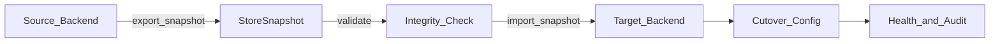

# teamVault – Storage-Abstraktion

**Status:** Planungsdokument (Teil B)  
**Bezug:** Sicherheitsprinzip 8; Konfigurationsphilosophie

---

## 1. Ziele

- Ein Storage-Interface, das **SQLite**, **PostgreSQL** und ein **verschlüsseltes JSON-File-Backend** austauschbar macht.
- Verschlüsselungslogik der Vault-Secrets ist dem Backend **nicht** bekannt und dort nicht implementiert.
- Backend-Wahl und Migration zur Laufzeit über Admin-UI, ohne Rebuild.
- Jedes Backend speichert für Vault-Inhalte nur **Ciphertext + notwendige Metadaten**.

---

## 2. Vertrag: Ciphertext-only

Das Storage-Backend darf persistieren:

- IDs, Tenant-IDs, Timestamps, Status-Enums
- User-Public-Keys, verschlüsselte Private-Key-Blobs, Envelopes
- Secret-Ciphertexts, Nonces, Key-Versions
- Audit-Metadaten ohne Klartext-Secrets

Das Storage-Backend darf **nicht**:

- Secrets entschlüsseln oder „hilfsweise“ serverseitig ver-/entschlüsseln
- Klartext-Master-Passwörter oder Private Keys sehen
- Backend-spezifische Klartext-Caches von Vault-Inhalten halten

At-rest-Verschlüsselung der **Config-DB** (via `MASTER_UNLOCK_KEY`) ist orthogonal und schützt Betriebsgeheimnisse (LDAP, SMTP), nicht die Zero-Knowledge-Vault-Payloads (diese sind bereits clientseitig verschlüsselt).

---

## 3. Interface-Design (konzeptionell)

Go-Interface (Namen illustrativ):

```go
type VaultStore interface {
    // Tenancy
    PutTenant(ctx context.Context, t Tenant) error
    GetTenant(ctx context.Context, id TenantID) (*Tenant, error)

    // Users / groups / memberships / permissions
    UpsertUser(ctx context.Context, u UserRecord) error
    ListUsers(ctx context.Context, tenant TenantID, q UserQuery) ([]UserRecord, error)
    // ... groups, collections, permissions analog

    // Secrets: opaque blobs only (ciphertext-only contract)
    PutSecretMeta(ctx context.Context, meta SecretMeta) error
    PutSecretCiphertext(ctx context.Context, id SecretID, blob CiphertextBlob) error
    PutKeyEnvelope(ctx context.Context, env KeyEnvelope) error
    InvalidateKeyVersion(ctx context.Context, secret SecretID, version uint32) error

    // Audit (append-only)
    AppendAudit(ctx context.Context, e AuditEvent) error

    // Ops
    Health(ctx context.Context) (Health, error)
    ExportSnapshot(ctx context.Context, tenant *TenantID) (*StoreSnapshot, error)
    ImportSnapshot(ctx context.Context, snap StoreSnapshot, mode ImportMode) error
}
```

### Semantik

| Typ | Bedeutung |
|-----|-----------|
| `CiphertextBlob` | `{ ciphertext, nonce, key_version, content_type }` – opaque bytes |
| `KeyEnvelope` | `{ secret_id, user_id, key_version, wrapped_dk }` – opaque |
| `StoreSnapshot` | Portables, backend-neutrales Interchange-Format (z. B. length-prefixed records oder CBOR/JSON mit base64-Blobs) |
| Tenant-Filter | Jede lesende/schreibende Methode tenant-scoped außer expliziter Super-Admin-Export |

Implementierungen: `sqlite.Store` (Phase 1 Default, `modernc.org/sqlite`), `jsonfile.Store` (Fallback), später `PostgresStore`.

Modul-Download im Firmennetz: [`docs/dev-proxy.md`](../dev-proxy.md).

---

## 4. Backend-Eigenschaften

| Backend | Stärken | Grenzen |
|---------|---------|---------|
| **SQLite** | Einfachster Start, Single-Node, Datei-Backup | Weniger parallel writes; HA begrenzt |
| **PostgreSQL** | Multi-Writer, Ops-Reife, Backups | Externe DB-Abhängigkeit |
| **Encrypted JSON** | Portable Datei, Air-Gap-freundlich | Skalierung/Query-Leistung; Datei-Locking |

JSON-Backend: Datei(en) mit Container-Verschlüsselung (Config-/Storage-Key nach Unlock), Inhalt weiterhin Vault-Ciphertexts – doppelte Schicht ist OK, ersetzt aber nicht Client-Crypto.

---

## 5. Schema-Migrationen (innerhalb eines Backends)

- Versionierte Migrationsskripte pro Backend (SQLite/PG) bzw. Dokument-Version im JSON-Store.
- App startet nur, wenn Schema-Version kompatibel oder Migration erfolgreich.
- Keine destruktive Migration ohne Backup-Hinweis in der Admin-UI.

---

## 6. Migration zwischen Backends (Admin-UI)



### Ablauf

1. Admin wählt Ziel-Backend und Verbindungsparameter (in verschlüsselter Config).
2. Preflight: Ziel erreichbar, leer oder `merge`/`replace`-Modus bestätigt.
3. **Export** Snapshot aus Quelle (optional tenant-weise).
4. **Validierung:** Record-Counts, Hash der Blob-IDs, Sample-Integrität (ohne Entschlüsselung).
5. **Import** in Ziel; bei Fehler Abbruch ohne Cutover.
6. **Cutover:** Config zeigt auf neues Backend; alter Store read-only bis Bestätigung.
7. Audit: `storage.migration.started|completed|failed`.
8. Rollback-Fenster: Config zurück auf Quelle, solange Quelle nicht gelöscht.

### Risiken

| Risiko | Mitigation |
|--------|------------|
| Datenverlust | Pflicht-Backup/Export vor Cutover; kein Auto-Delete der Quelle |
| Partial Write | Transaktionaler Import wo möglich; sonst Staging-Schema + atomarer Swap |
| Ciphertext-Korruption | Checksums im Snapshot; Verify-Pass |
| Tenant-Leaks | Snapshot und Import immer tenant-aware filtern |

---

## 7. Abgrenzung Config-DB vs. Vault-Store

| Store | Inhalt | Unlock |
|-------|--------|--------|
| Encrypted Config-DB | Tenants-Liste-Ref, LDAP/SMTP, Storage-Backend-Wahl, Argon2-Defaults | `MASTER_UNLOCK_KEY` |
| Vault-Store | User, Groups, Secrets (Ciphertext), Envelopes, Audit | Storage-Credentials aus Config |

Beide dürfen keine Vault-Klartexte halten.

---

## 8. Testfokus (Phase 1)

- Round-Trip Metadaten + opaque Blobs
- Tenant-Isolation (Query ohne `tenant_id` muss scheitern)
- Snapshot Export/Import SQLite ↔ SQLite zuerst; später Cross-Backend
- Kein Test darf Klartext-Secrets „zum Vergleich“ im Store erwarten

---

## 9. Verwandte Dokumente

- [`architecture.md`](architecture.md)
- [`admin-ui-scope.md`](admin-ui-scope.md)
- [`setup-wizard-flow.md`](setup-wizard-flow.md)
- [`open-questions.md`](open-questions.md)
