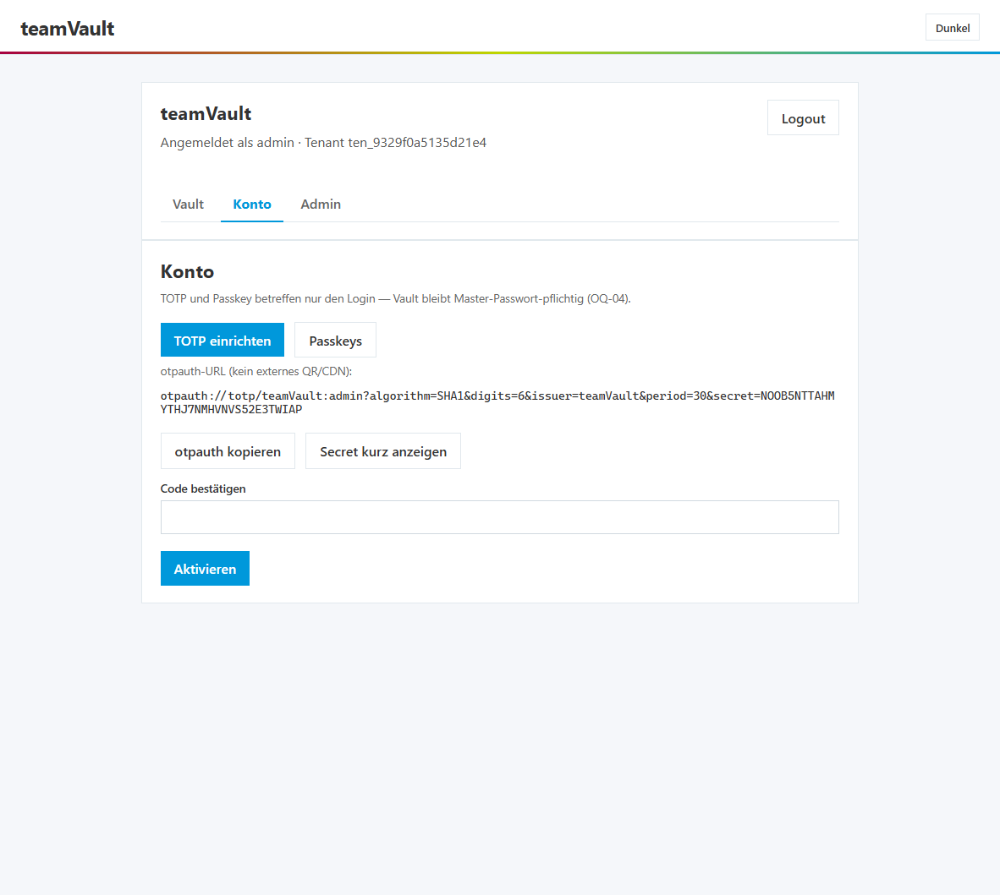

# teamVault – User Guide

Anleitung für den Alltag: Anmelden, Vault nutzen, teilen, Absichern.  
Installation und Admin-Themen: [Admin Guide](admin-guide.md).


## 1. Zwei Passwörter — warum?

| Geheimnis | Zweck |
|-----------|--------|
| **Login-Passwort** (oder Passkey + optional TOTP) | Session beim Server |
| **Master-Passwort** | Entschlüsselt Ihren privaten Schlüssel **nur im Browser** |

Der Server sieht niemals Ihr Master-Passwort und niemals Klartext-Secrets (Zero-Knowledge).

## 2. Erste Anmeldung

1. URL Ihrer Instanz öffnen → **Login**
2. **Tenant-Slug**, Username, Login-Passwort (TOTP falls aktiv)
3. Optional **Passkey** statt Passwort (wenn registriert)

Nach dem Login (oder nach Onboarding) erscheint **Vault entsperren**:


## 3. Vault-Onboarding (einmalig)

Beim ersten Vault-Zugriff:

1. Master-Passwort wählen (≥12 Zeichen) und wiederholen  
2. **Schlüssel erzeugen** (läuft lokal im Browser)  
3. **Recovery-Kit** einmalig sicher speichern (Passwortmanager offline, Tresor, …)  
4. Weiter zur App


Ohne Master-Passwort **und** ohne Recovery-Kit (bzw. ohne Admin-Escrow-Prozess) sind Ihre Secrets **nicht wiederherstellbar**.

## 4. Vault entsperren

Nach dem Login erscheint **Vault entsperren**. Master-Passwort eingeben → **Entsperren**.

- Bei Inaktivität (Default ca. 15 Minuten) sperrt die App den Vault erneut (Overlay).
- Logout beendet die Server-Session; der Schlüssel im Speicher wird gelöscht.

Oben rechts: Theme **Dunkel** / **Hell** (wird lokal gespeichert).


## 5. Secrets

Nach dem Entsperren: Liste mit clientseitiger **Suche** und **Ordner**-Filter.


### Anlegen

Felder: Titel, Ordner, Benutzername, Passwort, URL, TOTP-Seed, Tags, Favorit, Notizen → **Speichern (clientseitig verschlüsselt)**.

Titel und Payload werden vor dem Upload verschlüsselt; der Server speichert nur Ciphertext.

**Generator:** Länge und Symbole einstellen → **Generator** füllt das Passwortfeld (CSPRNG im Browser).


### Öffnen

In der Liste **Öffnen** — Klartext erscheint nur bei Ihnen im Browser. Felder mit **Kopieren** / Passwort **Anzeigen**.


### Teilen

Im Secret-Detail einen anderen User wählen → **Teilen**.  
Jeder Empfänger erhält einen eigenen Umschlag um den Datenschlüssel (kein gemeinsames Gruppenpasswort).

Admins können zusätzlich eine **Gruppe** wählen → **Gruppe teilen** (pro Mitglied eigener Envelope).

### Ordner

Beim Anlegen einen **Ordner**-Namen setzen. Die Liste filtert nach Ordner; die Suche trifft Titel und Ordnernamen (clientseitig).

### TOTP im Eintrag

Im Secret-Feld **TOTP-Seed** (base32 oder `otpauth://`) speichern. In der Detailansicht erscheint der aktuelle 6-stellige Code mit Countdown und **Kopieren** (siehe Screenshot oben).

### Import

Unter **Import** Bitwarden-JSON, CSV oder KeePass-XML wählen. Parsing und Verschlüsselung laufen nur im Browser; der Server sieht nur Ciphertext.


### Zugriff entziehen

**Zugriff entziehen + rotieren** — Datenschlüssel wird neu erzeugt; alte Versionen sind ungültig.

### Löschen

**Löschen** entfernt den Eintrag (nicht rückgängig über den Server).

## 6. TOTP (2FA für Login)

Tab **Konto** → **TOTP einrichten**:

1. otpauth-URL in Ihrer Authenticator-App hinterlegen (**otpauth kopieren**)  
2. Code bestätigen → **Aktivieren**  
3. Beim nächsten Login Feld **TOTP** ausfüllen  



TOTP schützt das Login, **nicht** die Vault-Entschlüsselung.

## 7. Passkeys

1. **Konto** → **Passkeys** → Namen vergeben → **Registrieren** (Browser/OS-Dialog)  
2. Beim Login: Tenant + Username → **Passkey**  

Passkeys ersetzen nur das Login — das Master-Passwort bleibt für den Vault nötig.

## 8. Browser-Extension

Ordner `clients/extension` in Chrome, Edge oder Firefox laden (siehe [clients/README.md](../clients/README.md)).

Typischer Ablauf:

1. Server-URL setzen, Login, Master-Passwort  
2. Secret wählen → **Copy** oder **Fill** (Autofill im aktiven Tab; Domain-Match priorisiert passende URLs; optional TOTP-Feld)

Schlüssel bleiben in der Popup-Sitzung, nicht im Content-Script.

## 9. CLI (`tvcli`)

Standalone-Binaries (Windows/Linux): `scripts/build-tvcli.ps1` → `dist/`.

```powershell
tvcli -base https://vault.example -api-key tvk_… whoami
tvcli secrets list
tvcli secrets get -id sec_…
tvcli secrets create -title "VPN" -username alice
```

Oder nach `tvcli login …` mit Session-Cookie.  
Master-Passwort wird bei Bedarf lokal abgefragt und nie an den Server gesendet.

## 10. Gute Praxis

- Master-Passwort lang und einzigartig; Recovery-Kit offline sichern  
- Login-Passwort ≠ Master-Passwort  
- Nach Teilen nur notwendige Personen; bei Austritt Admin um Entzug/Rotation bitten  
- Öffentliche/geteilte Rechner: nach Nutzung **Logout** und Browser schließen  
- Phishing: nur die bekannte Firmen-URL verwenden  

## 11. Hilfe

| Problem | Tipp |
|---------|------|
| Login ok, Vault nicht | Master-Passwort / Caps-Lock; Idle-Sperre |
| Recovery nötig | Kit + Anleitung des Admins (Escrow vs. User-Kit) |
| Passkey fehlt | Neu registrieren; Gerät/OS-Support prüfen |
| Secret „kein Zugriff“ | Noch nicht geteilt oder Rechte entzogen |

Technische API: [openapi.yaml](openapi.yaml) · Admin: [admin-guide.md](admin-guide.md)
