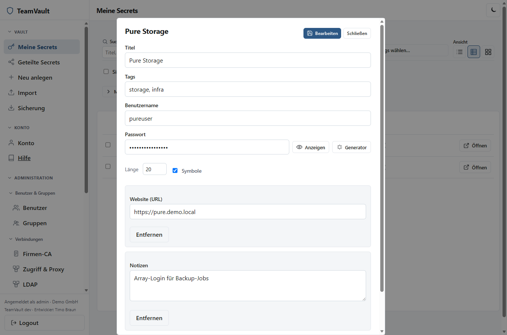
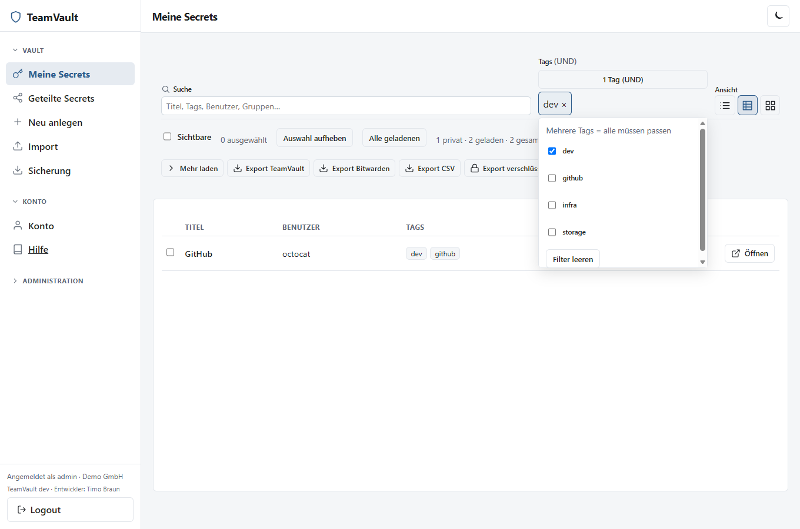
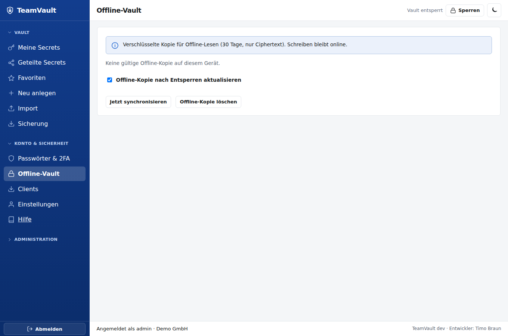
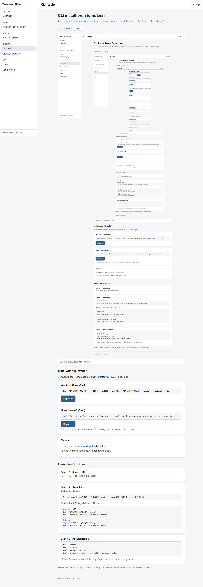
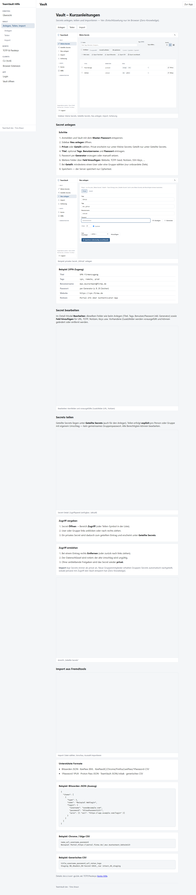
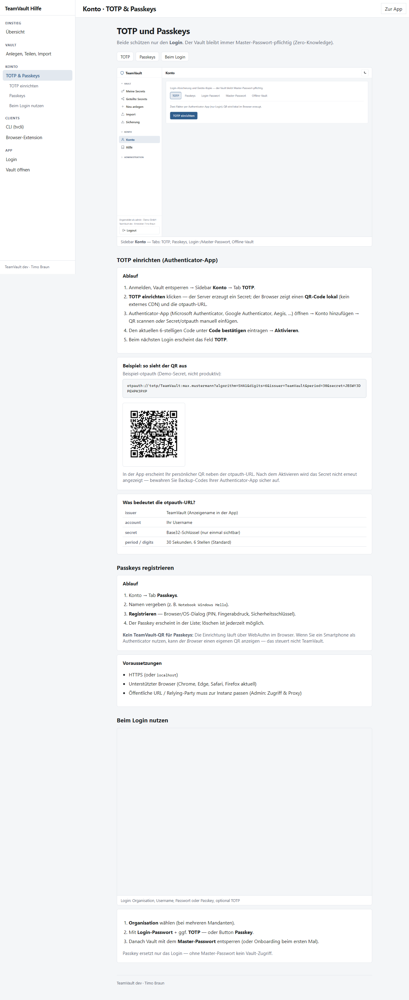

# TeamVault – User Guide

Anleitung für den Alltag: Anmelden, Vault nutzen, teilen, Absichern.  
Installation: [Installationsanleitung](install-guide.md) · Betrieb: [Admin Guide](admin-guide.md).

Version und Entwickler (Timo Braun) sehen Sie unten in der App bzw. unter Login.

## 1. Zwei Passwörter — warum?

| Geheimnis | Zweck |
|-----------|--------|
| **Login-Passwort** (oder Passkey + optional TOTP) | Session beim Server |
| **Master-Passwort** | Entschlüsselt Ihren privaten Schlüssel **nur im Browser** |

Der Server sieht niemals Ihr Master-Passwort und niemals Klartext-Secrets (Zero-Knowledge).

## 2. Erste Anmeldung

1. URL Ihrer Instanz öffnen → **Login**
2. **Organisation** (Dropdown der Mandanten), Username, Login-Passwort (TOTP falls aktiv)
3. Optional **Passkey** statt Passwort (wenn registriert)

Die zuletzt gewählte Organisation wird im Browser gemerkt. Bei genau einem Mandanten ist dieser vorausgewählt.

Oben rechts: **Hilfe** (ohne Login) öffnet die Client-Anleitungen unter `/help`. Hinweis unter dem Formular: Version und Entwickler. Optional **Offline entsperren**, wenn bereits eine lokale Ciphertext-Kopie auf dem Gerät liegt (siehe §6). Passkeys betreffen nur den Login — der Vault braucht weiterhin das Master-Passwort.

Nach dem Login (oder nach Onboarding) erscheint **Vault entsperren**:

## 3. Vault-Onboarding (einmalig)

Beim ersten Vault-Zugriff führt ein **zweistufiger Assistent** durch die Einrichtung:

1. **Schritt 1 — Master-Passwort:** ≥12 Zeichen wählen und wiederholen → **Schlüssel erzeugen** (läuft lokal im Browser)
2. **Schritt 2 — Recovery-Kit** (bei Modus *User Recovery-Kit*): Kit **kopieren** oder **herunterladen**, Checkliste abarbeiten, Häkchen **Ich habe das Recovery-Kit gesichert** setzen → **Weiter zur App**
3. Bei **Admin-Escrow** entfällt das Kit — nach der Schlüsselerzeugung direkt **Weiter zur App**

Ohne Master-Passwort **und** ohne Recovery-Kit (bzw. ohne Admin-Escrow-Prozess) sind Ihre Secrets **nicht wiederherstellbar**.

## 4. Vault entsperren

Nach dem Login erscheint **Vault entsperren**. Master-Passwort eingeben → **Entsperren** (auch mit **Enter**).

- Bei Inaktivität (Default ca. 15 Minuten) sperrt die App den Vault erneut (opakes Overlay).
- Logout beendet die Server-Session; der Schlüssel im Speicher wird gelöscht.

Oben rechts: Theme-Umschalter als **Sonne/Mond-Icon** (wird lokal gespeichert). Die Sidebar nutzt flache Inline-Icons; die Hauptbereiche **Vault**, **Konto** und **Administration** sind einklappbar (Zustand wird im Browser gemerkt). Auf schmalen Viewports: Menü-Taste öffnet die Sidebar (Schließen mit Backdrop oder **Escape**).

## 5. Secrets

Nach dem Entsperren: linke **Sidebar** mit Icons. Unter Vault getrennt:

| Menü | Inhalt |
|------|--------|
| **Meine Secrets** | Private Secrets (nur Sie) — `visibility=private` |
| **Geteilte Secrets** | Team-Secrets mit User-/Gruppen-Freigabe — `visibility=shared` (auch wenn Sie der Anleger sind) |
| **Neu anlegen** | Formular für einen neuen Eintrag |
| **Import** | Dateien aus anderen Passwortmanagern übernehmen |
| **Sicherung** | Verschlüsselte `.tvbak`-Backup / Wiederherstellen |

Kein vermischter „Alle“-Eintrag. Clientseitige **Suche** (Titel, Tags, Benutzer, Gruppen) und **Tag**-Filter (Mehrfach, UND) gelten jeweils für die aktive Ansicht. In der Liste können Sie Einträge per Checkbox für den Export auswählen.

**Ansicht:** Standard ist **Tabelle**; Umschalter Liste / Tabelle / Kacheln (Preference lokal im Browser). Tabelle und Kacheln laden zusätzlich Benutzer, Tags, **freigegebene Gruppen** und Favorit; Liste zeigt Titel, Benutzer, Tags und Gruppen kompakt.

### Anlegen

Sidebar **Neu anlegen**: Titel, Tags, Benutzername und Passwort sind immer sichtbar. Weitere Felder über **Feld hinzufügen**:

| Typ | Inhalt |
|-----|--------|
| Website (URL) | Mehrfach möglich |
| TOTP-Seed | base32 oder `otpauth://` |
| Notizen / Tags / Favorit | wie bisher |
| SSH Private/Public Key | Paste oder **Datei laden** |
| S3 Access / Secret Key | Zugangsdaten |
| Zertifikat (PEM) | Paste oder Datei |
| Freitext / Geheimnis | Custom-Felder |

Beim Anlegen zuerst **Privat** oder **Geteilt** wählen:

- **Privat** — erscheint nur unter **Meine Secrets**; nur Sie haben Zugriff.
- **Geteilt** — erscheint unter **Geteilte Secrets** (auch für den Anleger, nicht unter Meine Secrets). Mindestens ein User oder eine Gruppe ist Pflicht; alle Berechtigten können den Eintrag bearbeiten.

Titel und Payload werden vor dem Upload verschlüsselt; der Server speichert nur Ciphertext.

**Generator:** Länge und Symbole einstellen → **Generator** füllt das Passwortfeld (CSPRNG im Browser).

### Öffnen & Bearbeiten

In der Liste **Öffnen** — Detail erscheint als **Modal** über der Liste (Schließen mit Button, Backdrop oder **Escape**). Klartext nur im Browser. Felder mit **Kopieren** / **Anzeigen**; Key/Zertifikat zusätzlich **Download**. Live-**TOTP** erscheint, wenn ein Seed hinterlegt ist. Mehrere Websites werden einzeln angezeigt.

**Bearbeiten** im Modal: dieselben Kernfelder wie beim Anlegen (Titel, Tags, Benutzername, Passwort inkl. Generator) sowie **Feld hinzufügen** für Website/URL, TOTP-Seed, Notizen, Favorit, SSH-Keys, S3, Zertifikat, Freitext/Geheimnis. Speichern verschlüsselt clientseitig (`PUT /api/secrets/{id}`). Bei geteilten Secrets kann jeder mit Envelope speichern.

### Teilen

Im Secret-Detail unter **Zugriff** verfügbare User und Gruppen per Klick oder Drag & Drop hinzufügen. Entfernen rotiert den Datenschlüssel (alter Schlüssel wird ungültig).  
Jeder Empfänger erhält einen eigenen Umschlag um den Datenschlüssel (kein gemeinsames Gruppenpasswort). Empfänger müssen im gleichen Tenant **onboarded** sein.

Ein privates Secret wird durch Teilen zum **geteilten** Secret und wandert in die Liste **Geteilte Secrets**. Entfernen aller Freigaben macht es wieder privat.

Die Tabelle **Geteilte Secrets** zeigt Anleger, User- und Gruppen-Freigaben. **Meine Secrets** bleibt ohne Freigabe-Spalten (nur Teilen-Aktion).

Wird ein User **neu in eine Gruppe** aufgenommen, teilt TeamVault die Gruppen-Secrets automatisch nach — sofern jemand mit Zugriff (z.&nbsp;B. Admin) den Vault **entsperrt** hat bzw. beim Hinzufügen entsperrt ist. Der Server erzeugt keine Umschläge (Zero-Knowledge); fehlende Freigaben werden beim nächsten Unlock nachgeholt.

**Import** legt Secrets immer als **privat** an.

### Tags & Suche

Beim Anlegen **Tags** setzen (Komma-getrennt). Die Toolbar filtert nach **einem oder mehreren Tags mit UND-Logik** (z.&nbsp;B. Storage **und** Block **und** Prod); die Suche trifft **Titel, Tags, Benutzername, Ersteller und Gruppen** (clientseitig bzw. aus der API).

### TOTP im Eintrag

Über **Feld hinzufügen → TOTP-Seed** (base32 oder `otpauth://`). In der Detailansicht erscheint der aktuelle 6-stellige Code mit Countdown und **Kopieren**.

### Mehrere Websites

Mehrfach **Website (URL)** hinzufügen. Import aus Bitwarden übernimmt alle `uris`. Die Extension matcht den aktiven Tab gegen jede hinterlegte URL.

### Import

Sidebar **Import**: Datei wählen. Unterstützte Formate:

- TeamVault JSON / verschlüsselte `.tvbak`
- Bitwarden JSON (Login-Einträge)
- KeePass XML, KeePassXC-CSV
- Chrome/Edge- und Firefox-CSV
- LastPass-CSV, 1Password-CSV, 1Password 1PUX (`export.data`)
- Proton Pass JSON
- generisches CSV (`title,username,password,url,…`)

Nach dem Parsen erscheint eine **Vorschau** — einzelne, mehrere oder alle Einträge anhaken, dann **Auswahl importieren**. Verschlüsselte `.tvbak` erst mit Backup-Passwort entsperren. Parsing und Verschlüsselung laufen nur im Browser; der Server sieht nur Ciphertext. Import legt Secrets **nur für Sie** an (keine automatische Gruppen-Freigabe).

### Export

In der Secrets-Liste Einträge per Checkbox wählen (eines, mehrere, oder **Alle geladenen**). Ohne Auswahl gelten die **sichtbaren** Einträge (aktueller Tag-Filter UND/Suche).

- **Export TeamVault** — vollständiges JSON inkl. Extra-Felder
- **Export Bitwarden** — Login-Subset, unverschlüsselt
- **Export CSV** — Klartext
- **Export verschlüsselt** — `.tvbak` mit eigenem Backup-Passwort (Argon2id)

Im Secret-Detail: **Dieses Secret exportieren**. Bestätigung, weil Klartext auf Disk landet (außer `.tvbak`). Es werden nur Einträge exportiert, die Sie entschlüsseln können — der Server sieht den Klartext nicht.

### Sicherung (Backup / Restore)

Sidebar **Sicherung**: alle für Sie entschlüsselbaren Secrets als verschlüsselte `.tvbak` herunterladen. Wiederherstellen legt die Einträge **neu** an (bestehende bleiben). Backup-Passwort mindestens 12 Zeichen, getrennt vom Master-Passwort und Unlock-Key aufbewahren.

Instanz-weites Ciphertext-Backup (Tenants, User, Secrets): siehe [Admin Guide](admin-guide.md#5-backup).

### Zugriff entziehen

**Zugriff entziehen + rotieren** — Datenschlüssel wird neu erzeugt; alte Versionen sind ungültig. Die Rotation schreibt Ciphertext und neue Envelopes atomar (kein Zwischenzustand ohne gültige Umschläge).

### Löschen

**Löschen** entfernt den Eintrag (nicht rückgängig über den Server). Nur wer einen gültigen Envelope hat, darf löschen.

## 6. Konto: TOTP, Passkeys, Passwörter

Sidebar **Konto**:

### Login-2FA (TOTP)

1. **TOTP einrichten** → QR scannen (lokal im Browser erzeugt, kein CDN) oder otpauth-URL/**Secret** in die Authenticator-App übernehmen  
2. Code bestätigen → **Aktivieren**  
3. Beim nächsten Login Feld **TOTP** ausfüllen  

Online-Hilfe mit Beispiel-QR: `/help/account`. TOTP schützt das Login, **nicht** die Vault-Entschlüsselung.

### Passkeys

1. **Passkeys** → Namen vergeben → **Registrieren** (Browser/OS-Dialog)  
2. Beim Login: Tenant + Username → **Passkey**  

Passkeys ersetzen nur das Login — das Master-Passwort bleibt für den Vault nötig. TeamVault erzeugt **keinen** eigenen Passkey-QR; ggf. zeigt der Browser bei geräteübergreifender Anmeldung selbst einen QR.

### Login-Passwort ändern

Nur bei **lokalem** Auth-Backend: aktuelles + neues Login-Passwort (≥12) → **Login-Passwort speichern**. LDAP-User ändern das Passwort in AD.

### Master-Passwort ändern

Aktuelles und neues Master-Passwort eingeben → **Master-Passwort speichern**. Der Private Key wird **nur im Browser** neu versiegelt; der Server speichert neue Ciphertexte. Bei Recovery-Modus `user_kit` erscheint ein neues Recovery-Kit (einmalig sichern).

### Offline-Vault (optional)

Wenn der Administrator den Offline-Cache erlaubt, können Sie unter **Konto** eine verschlüsselte lokale Kopie (nur Ciphertext, 30 Tage) vorhalten:

1. Online anmelden, Vault entsperren  
2. **Offline-Kopie nach Entsperren aktualisieren** aktivieren → Sync läuft im Hintergrund (Fortschritt in der Sidebar)  
3. Ohne Netz: Login-Seite **Offline entsperren** oder `/app?offline=1` — nur Master-Passwort, kein TOTP  

Im Offline-Modus: **nur Lesen**; Admin-Bereich und Schreibaktionen sind ausgeblendet. **Logout** löscht die Offline-Kopie nicht — unter Konto **Offline-Kopie löschen** oder Opt-in deaktivieren.

Voraussetzungen: HTTPS oder `localhost` (Service Worker / PWA). Details: [Installationsanleitung – Offline/PWA](install-guide.md#offline-vault--pwa-optional).

## 7. Browser-Extension

Kurzanleitung in der App: Sidebar **Hilfe** bzw. Login **Hilfe** → **Browser-Extension**, oder direkt `/help/extension`. Markdown: [`docs/extension-guide.md`](extension-guide.md).

Kurz: Extension laden → Server-URL → Login/Unlock → auf passender Website **Fill** / **Copy** (nur bei Domain-Match).

## 8. CLI (`tvcli`)

Kurzanleitung: **Hilfe → CLI** bzw. `/help/cli`. Markdown: [`docs/cli-guide.md`](cli-guide.md).

Einzeiler und Alltagsbefehle stehen dort. API-Keys brauchen mindestens einen Scope:

| Scope | Erlaubt |
|-------|---------|
| `read` | GET-Allowlist (me, Vault-Status/Keys, Secrets Liste/Detail, eigene Gruppen) |
| `vault` | Secret-/Vault-Schreibaktionen (zusätzlich zu lesenden GETs) |
| `admin` | `/api/admin/*` (zusätzlich User-Rollen nötig) |

Nur `read` → keine Admin- oder Schreibaktionen. Cookie-Login ohne API-Key ist nicht scope-beschränkt.

**Legacy-Keys** (vor Scope-Pflicht angelegt, ohne `scopes`): nur lesende GET-Requests — für Automation/CLI neuen Key mit passenden Scopes ausstellen lassen.

## 9. Gute Praxis

- Master-Passwort lang und einzigartig; Recovery-Kit offline sichern  
- Login-Passwort ≠ Master-Passwort  
- Nach Teilen nur notwendige Personen; bei Austritt Admin um Entzug/Rotation bitten  
- Öffentliche/geteilte Rechner: nach Nutzung **Logout** und Browser schließen  
- Phishing: nur die bekannte Firmen-URL verwenden; Extension Fill/Copy nur bei Host-Match  
- Klartext-Export (JSON/CSV) sicher ablegen und zeitnah löschen  
- `.tvbak` und Backup-Passwort getrennt vom Unlock-Key und Master-Passwort aufbewahren  

## 10. Hilfe

Übersicht Web-App / Vault / Konto (TOTP & Passkeys) / CLI / Extension auf der Instanz unter **`/help`** (auch Sidebar **Hilfe** oder Login-Header):

**Vault** — Anlegen, Teilen, Import:

**Konto** — TOTP (inkl. QR) und Passkeys: **`/help/account`**

| Problem | Tipp |
|---------|------|
| Login ok, Vault nicht | Master-Passwort / Caps-Lock; Idle-Sperre |
| Recovery nötig | Kit + Anleitung des Admins (Escrow vs. User-Kit) |
| Passkey fehlt | Neu registrieren; Gerät/OS-Support prüfen |
| Secret „kein Zugriff“ | Noch nicht geteilt oder Rechte entzogen |
| Fill/Copy blockiert | Secret-URL passt nicht zum Tab-Host |
| Import leer / Format? | Vorschau prüfen; KeePass nur XML (kein `.kdbx`); `.tvbak` braucht Backup-Passwort |
| CLI/Extension-Install | `/help/cli` bzw. `/help/extension`; Admin muss `/downloads/` befüllen |
| Offline-Kopie abgelaufen | Erneut online anmelden und synchronisieren (TTL 30 Tage) |
| „Offline vom Administrator deaktiviert“ | Admin → Krypto & Policy → Offline-Cache erlauben |

Technische API: [openapi.yaml](openapi.yaml) · Installation: [install-guide.md](install-guide.md) · Admin: [admin-guide.md](admin-guide.md)
