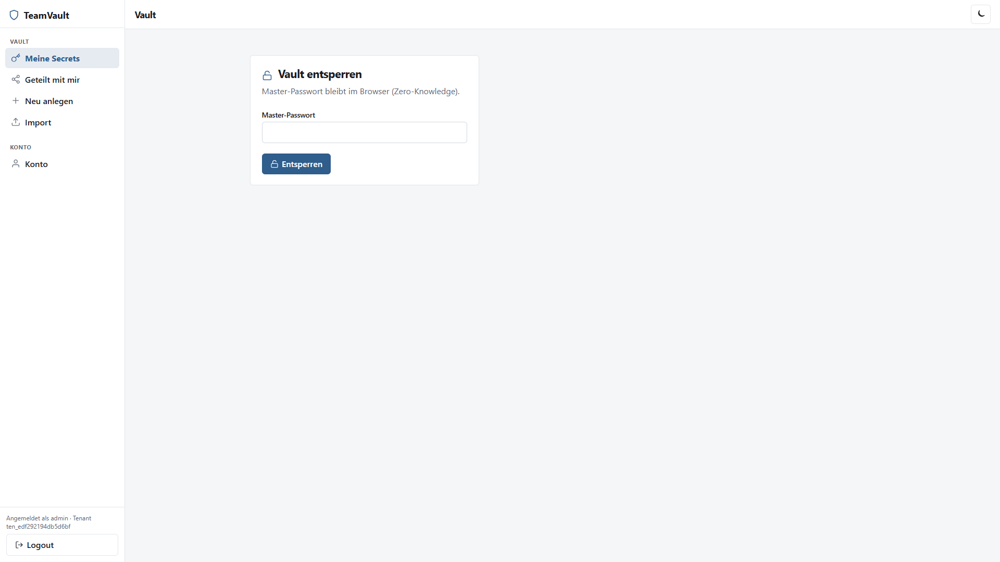
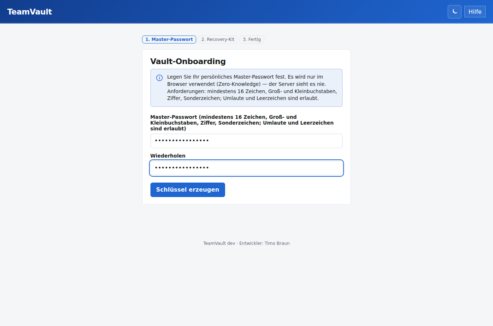
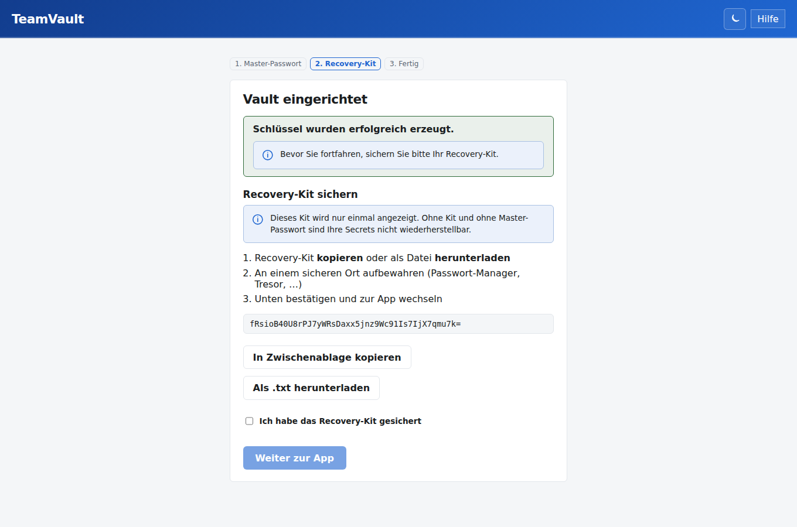
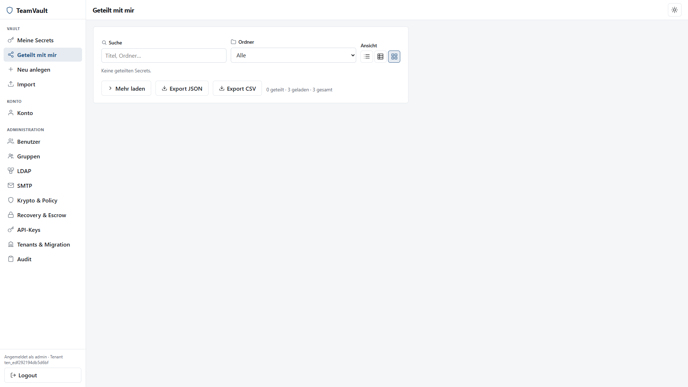
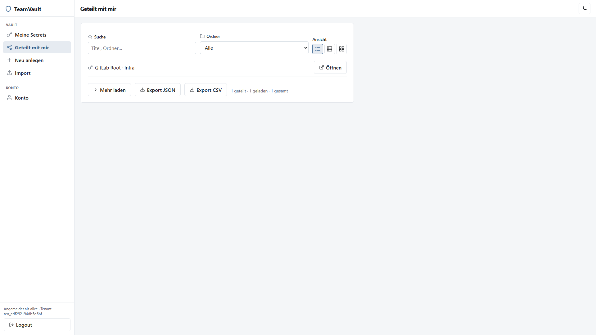
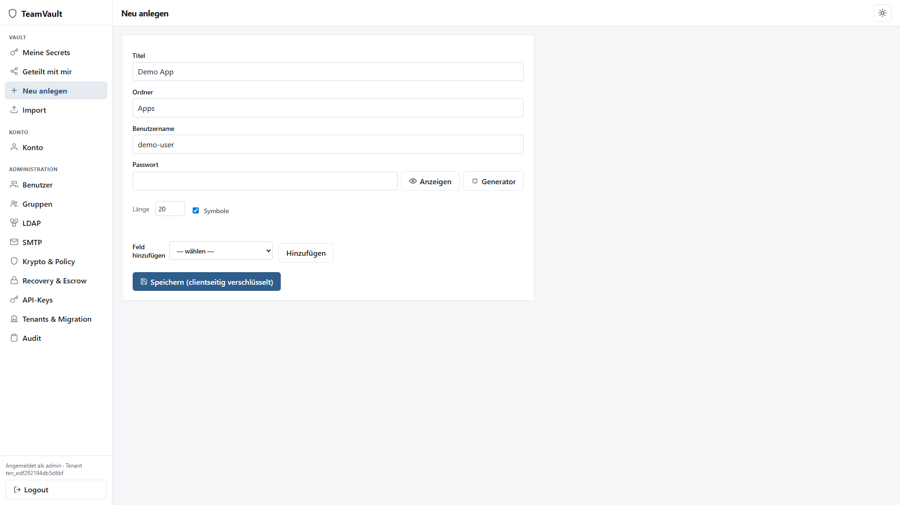
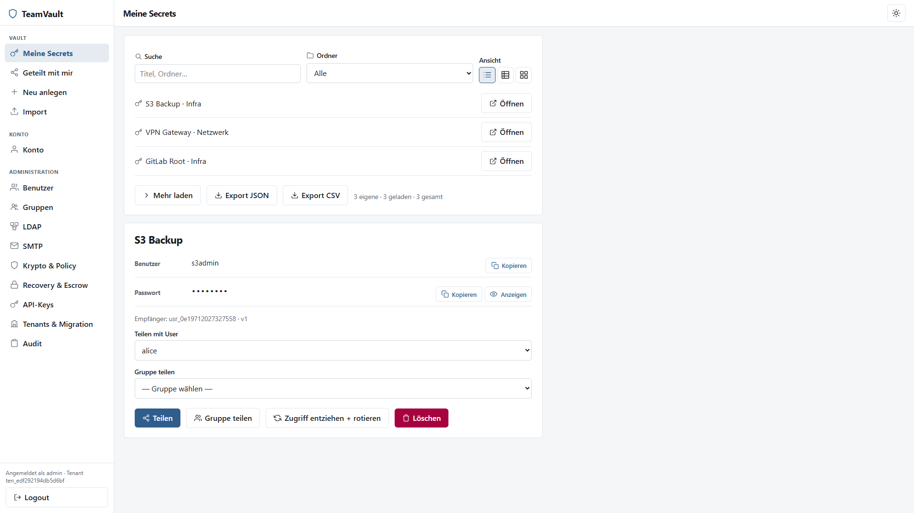
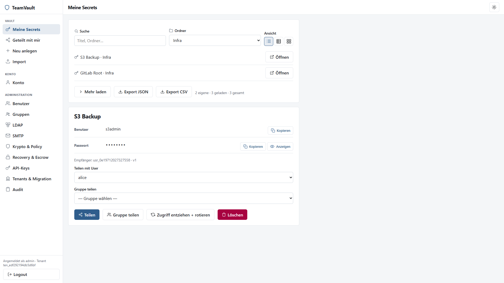
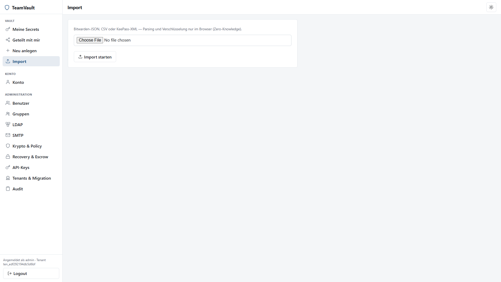
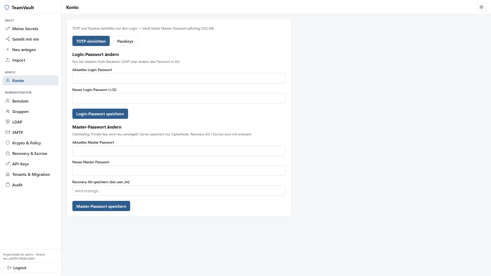

# TeamVault – User Guide

Anleitung für den Alltag: Anmelden, Vault nutzen, teilen, Absichern.  
Installation und Admin-Themen: [Admin Guide](admin-guide.md).


## 1. Zwei Passwörter — warum?

| Geheimnis | Zweck |
|-----------|--------|
| **Login-Passwort** (oder Passkey + optional TOTP) | Session beim Server |
| **Master-Passwort** | Entschlüsselt Ihren privaten Schlüssel **nur im Browser** |

Der Server sieht niemals Ihr Master-Passwort und niemals Klartext-Secrets (Zero-Knowledge).

## 2. Erste Anmeldung

1. URL Ihrer Instanz öffnen → **Login**
2. **Tenant-Slug**, Username, Login-Passwort (TOTP falls aktiv)
3. Optional **Passkey** statt Passwort (wenn registriert)

Nach dem Login (oder nach Onboarding) erscheint **Vault entsperren**:



## 3. Vault-Onboarding (einmalig)

Beim ersten Vault-Zugriff:

1. Master-Passwort wählen (≥12 Zeichen) und wiederholen  
2. **Schlüssel erzeugen** (läuft lokal im Browser)  
3. **Recovery-Kit** einmalig sicher speichern (Passwortmanager offline, Tresor, …)  
4. Weiter zur App





Ohne Master-Passwort **und** ohne Recovery-Kit (bzw. ohne Admin-Escrow-Prozess) sind Ihre Secrets **nicht wiederherstellbar**.

## 4. Vault entsperren

Nach dem Login erscheint **Vault entsperren**. Master-Passwort eingeben → **Entsperren** (auch mit **Enter**).

- Bei Inaktivität (Default ca. 15 Minuten) sperrt die App den Vault erneut (opakes Overlay).
- Logout beendet die Server-Session; der Schlüssel im Speicher wird gelöscht.

Oben rechts: Theme-Umschalter als **Sonne/Mond-Icon** (wird lokal gespeichert). Die Sidebar nutzt flache Inline-Icons neben den Menüpunkten. Auf schmalen Viewports: Menü-Taste öffnet die Sidebar (Schließen mit Backdrop oder **Escape**).


## 5. Secrets

Nach dem Entsperren: linke **Sidebar** mit Icons. Unter Vault getrennt:

| Menü | Inhalt |
|------|--------|
| **Meine Secrets** | Einträge, die Sie angelegt haben (`created_by` = Sie) |
| **Geteilt mit mir** | Einträge mit Zugriff, die jemand anderes angelegt hat |

Kein vermischter „Alle“-Eintrag. Clientseitige **Suche** und **Ordner**-Filter gelten jeweils für die aktive Ansicht.

**Ansicht:** Umschalter Liste / Tabelle / Kacheln (Preference lokal im Browser). Liste zeigt Titel und Ordner; Tabelle und Kacheln laden zusätzlich Benutzer, Tags und Favorit (clientseitig entschlüsselt).







### Anlegen

Sidebar **Neu anlegen**: Titel, Ordner, Benutzername und Passwort sind immer sichtbar. Weitere Felder über **Feld hinzufügen**:

| Typ | Inhalt |
|-----|--------|
| Website (URL) | Mehrfach möglich |
| TOTP-Seed | base32 oder `otpauth://` |
| Notizen / Tags / Favorit | wie bisher |
| SSH Private/Public Key | Paste oder **Datei laden** |
| S3 Access / Secret Key | Zugangsdaten |
| Zertifikat (PEM) | Paste oder Datei |
| Freitext / Geheimnis | Custom-Felder |

Titel und Payload werden vor dem Upload verschlüsselt; der Server speichert nur Ciphertext.

**Generator:** Länge und Symbole einstellen → **Generator** füllt das Passwortfeld (CSPRNG im Browser).



### Öffnen

In der Liste **Öffnen** — Klartext erscheint nur bei Ihnen im Browser. Felder mit **Kopieren** / **Anzeigen**; Key/Zertifikat zusätzlich **Download**. Live-**TOTP** erscheint, wenn ein Seed hinterlegt ist. Mehrere Websites werden einzeln angezeigt.



### Teilen

Im Secret-Detail einen anderen User wählen → **Teilen**.  
Jeder Empfänger erhält einen eigenen Umschlag um den Datenschlüssel (kein gemeinsames Gruppenpasswort). Empfänger müssen im gleichen Tenant **onboarded** sein.

Admins und Gruppenmitglieder können eine **Gruppe** wählen → **Gruppe teilen** (Mitglieder sehen nur eigene Gruppen; pro Mitglied eigener Envelope). Empfänger sehen den Eintrag unter **Geteilt mit mir**.

### Ordner

Beim Anlegen einen **Ordner**-Namen setzen. Die Liste filtert nach Ordner; die Suche trifft Titel und Ordnernamen (clientseitig).



### TOTP im Eintrag

Über **Feld hinzufügen → TOTP-Seed** (base32 oder `otpauth://`). In der Detailansicht erscheint der aktuelle 6-stellige Code mit Countdown und **Kopieren**.

### Mehrere Websites

Mehrfach **Website (URL)** hinzufügen. Import aus Bitwarden übernimmt alle `uris`. Die Extension matcht den aktiven Tab gegen jede hinterlegte URL.

### Import

Sidebar **Import**: Bitwarden-JSON, CSV oder KeePass-XML wählen. Parsing und Verschlüsselung laufen nur im Browser; der Server sieht nur Ciphertext.



### Export

Unter der Secrets-Liste: **Export JSON** (Bitwarden-Login-Subset, unverschlüsselt lokal) oder **Export CSV** — mit Bestätigung, weil Klartext auf Disk landet. Es werden nur Einträge exportiert, die Sie entschlüsseln können — der Server sieht den Klartext nicht.


### Zugriff entziehen

**Zugriff entziehen + rotieren** — Datenschlüssel wird neu erzeugt; alte Versionen sind ungültig. Die Rotation schreibt Ciphertext und neue Envelopes atomar (kein Zwischenzustand ohne gültige Umschläge).

### Löschen

**Löschen** entfernt den Eintrag (nicht rückgängig über den Server). Nur wer einen gültigen Envelope hat, darf löschen.

## 6. Konto: TOTP, Passkeys, Passwörter

Sidebar **Konto**:



### Login-2FA (TOTP)

1. **TOTP einrichten** → otpauth-URL in der Authenticator-App (**otpauth kopieren**)  
2. Code bestätigen → **Aktivieren**  
3. Beim nächsten Login Feld **TOTP** ausfüllen  

TOTP schützt das Login, **nicht** die Vault-Entschlüsselung.

### Passkeys

1. **Passkeys** → Namen vergeben → **Registrieren** (Browser/OS-Dialog)  
2. Beim Login: Tenant + Username → **Passkey**  

Passkeys ersetzen nur das Login — das Master-Passwort bleibt für den Vault nötig.

### Login-Passwort ändern

Nur bei **lokalem** Auth-Backend: aktuelles + neues Login-Passwort (≥12) → **Login-Passwort speichern**. LDAP-User ändern das Passwort in AD.

### Master-Passwort ändern

Aktuelles und neues Master-Passwort eingeben → **Master-Passwort speichern**. Der Private Key wird **nur im Browser** neu versiegelt; der Server speichert neue Ciphertexte. Bei Recovery-Modus `user_kit` erscheint ein neues Recovery-Kit (einmalig sichern).

## 7. Browser-Extension

Ordner `clients/extension` in Chrome, Edge oder Firefox laden (siehe [clients/README.md](../clients/README.md)).

Typischer Ablauf:

1. Server-URL setzen, Login, Master-Passwort  
2. Secret wählen → **Copy** oder **Fill**  

**Fill** und **Copy** sind nur erlaubt, wenn eine hinterlegte Website-URL zum Host des aktiven Tabs passt — sonst Warnung/Block (Phishing-Schutz). Optional Domain-Filter in der Liste.

Schlüssel bleiben in der Popup-Sitzung, nicht im Content-Script.

## 8. CLI (`tvcli`)

Standalone-Binaries (Windows/Linux): `scripts/build-tvcli.ps1` → `dist/`.

```powershell
tvcli -base https://vault.example -api-key tvk_… whoami
tvcli secrets list
tvcli secrets get -id sec_…
tvcli secrets create -title "VPN" -username alice
tvcli secrets create -title "Git" -url https://git.example.local -ssh-private-file ./id_ed25519
```

Oder nach `tvcli login …` mit Session-Cookie.  
Master-Passwort wird bei Bedarf lokal abgefragt und nie an den Server gesendet.

API-Keys brauchen mindestens einen Scope:

| Scope | Erlaubt |
|-------|---------|
| `read` | GET-Allowlist (me, Vault-Status/Keys, Secrets Liste/Detail, eigene Gruppen) |
| `vault` | Secret-/Vault-Schreibaktionen (zusätzlich zu lesenden GETs) |
| `admin` | `/api/admin/*` (zusätzlich User-Rollen nötig) |

Nur `read` → keine Admin- oder Schreibaktionen. Cookie-Login ohne API-Key ist nicht scope-beschränkt.

**Legacy-Keys** (vor Scope-Pflicht angelegt, ohne `scopes`): nur lesende GET-Requests — für Automation/CLI neuen Key mit passenden Scopes ausstellen lassen.

## 9. Gute Praxis

- Master-Passwort lang und einzigartig; Recovery-Kit offline sichern  
- Login-Passwort ≠ Master-Passwort  
- Nach Teilen nur notwendige Personen; bei Austritt Admin um Entzug/Rotation bitten  
- Öffentliche/geteilte Rechner: nach Nutzung **Logout** und Browser schließen  
- Phishing: nur die bekannte Firmen-URL verwenden; Extension Fill/Copy nur bei Host-Match  
- Export-Dateien enthalten Klartext — sicher ablegen und zeitnah löschen  

## 10. Hilfe

| Problem | Tipp |
|---------|------|
| Login ok, Vault nicht | Master-Passwort / Caps-Lock; Idle-Sperre |
| Recovery nötig | Kit + Anleitung des Admins (Escrow vs. User-Kit) |
| Passkey fehlt | Neu registrieren; Gerät/OS-Support prüfen |
| Secret „kein Zugriff“ | Noch nicht geteilt oder Rechte entzogen |
| Fill/Copy blockiert | Secret-URL passt nicht zum Tab-Host |

Technische API: [openapi.yaml](openapi.yaml) · Admin: [admin-guide.md](admin-guide.md)
